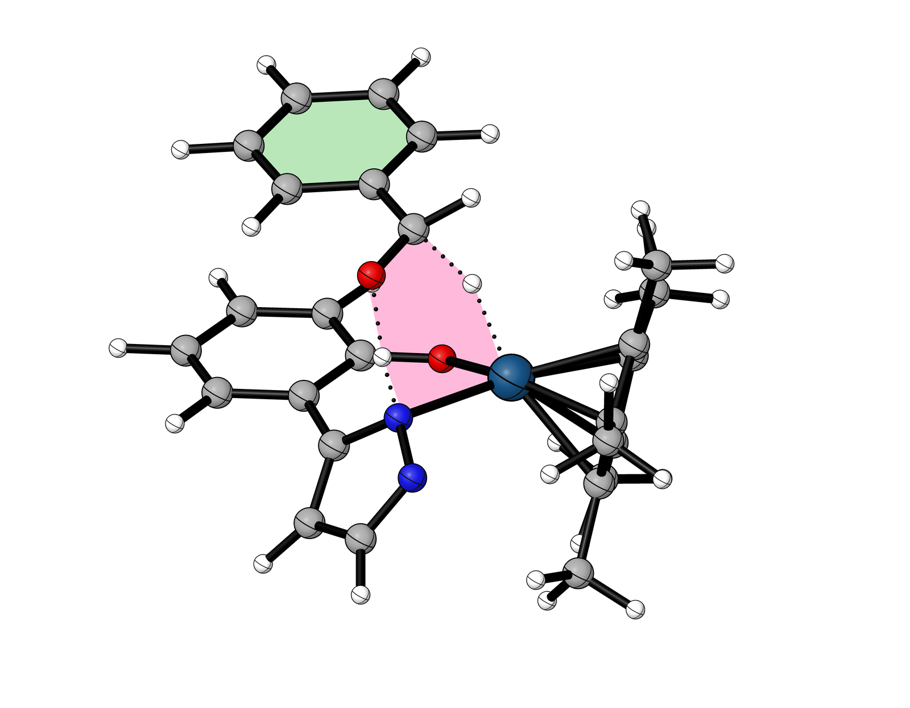
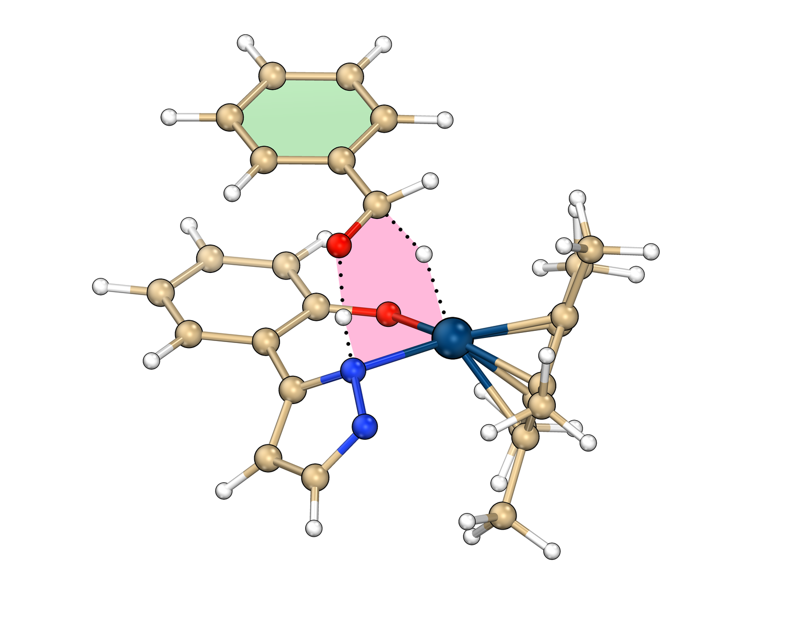
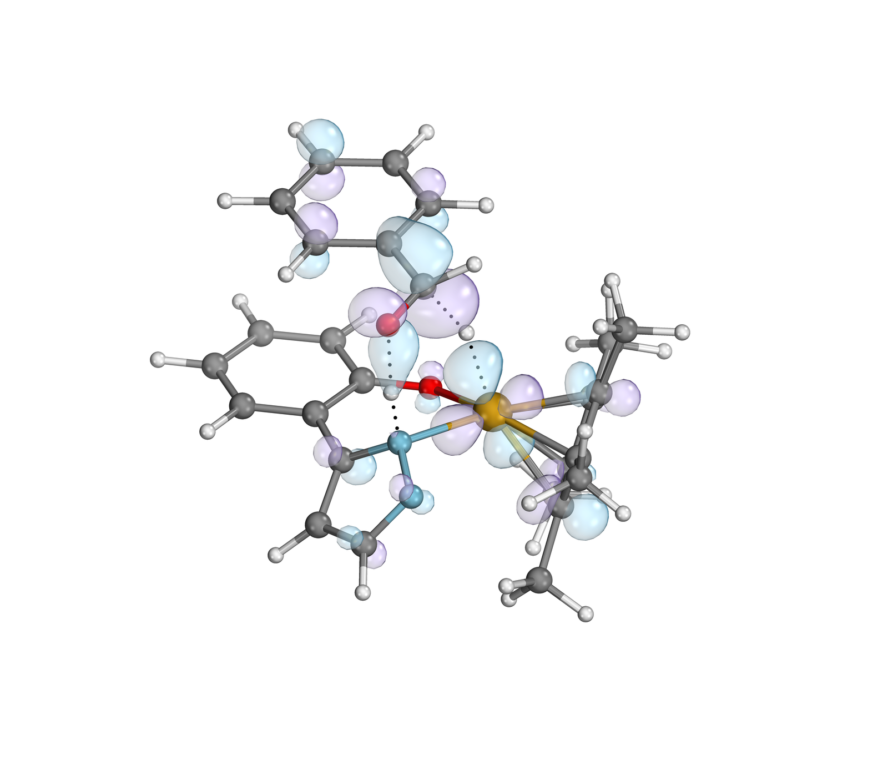
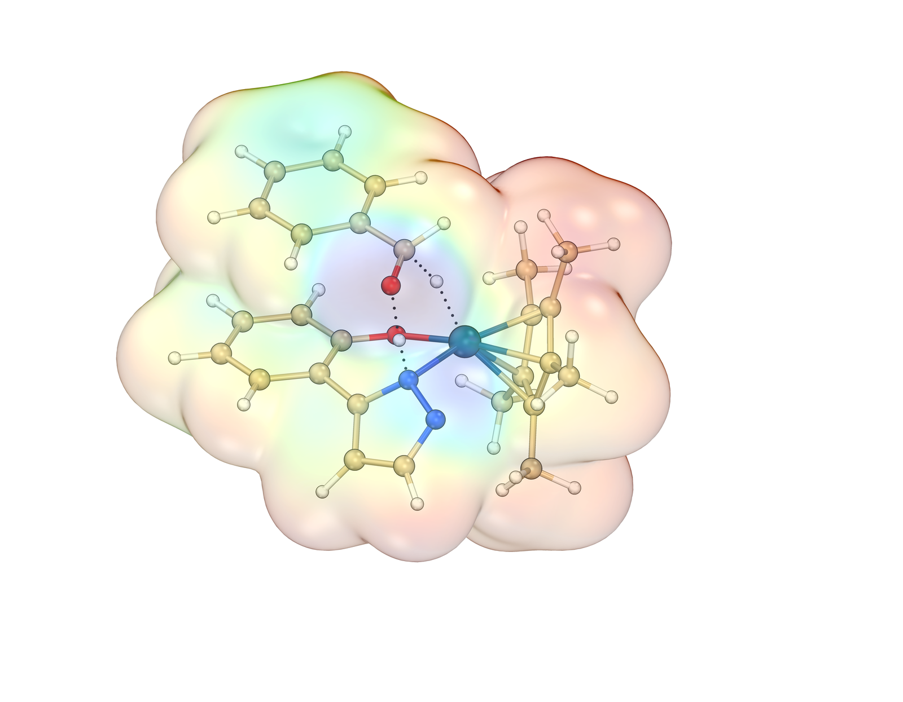
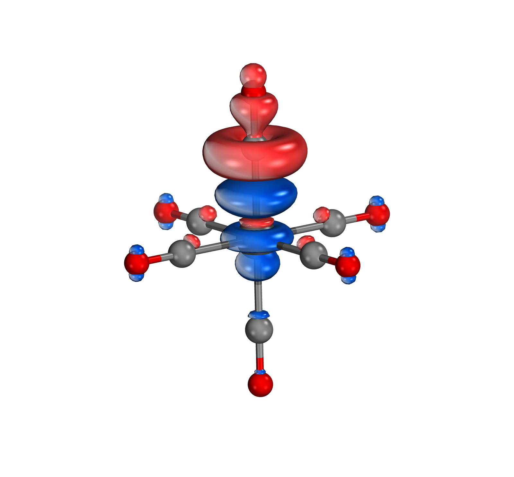
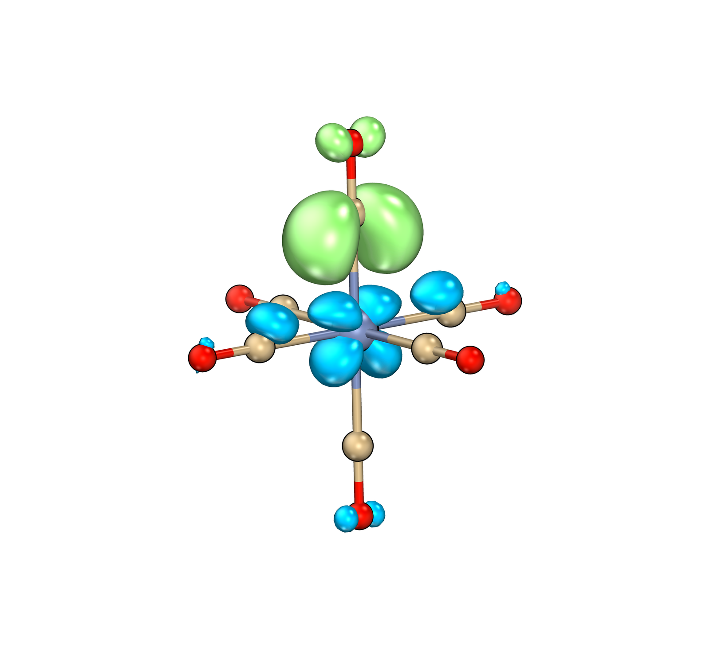
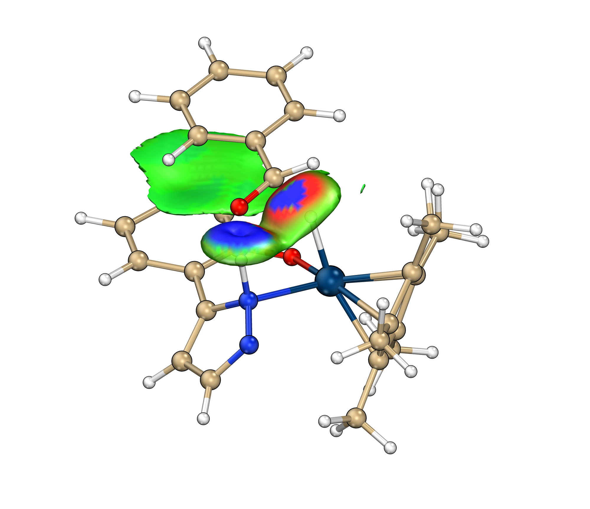
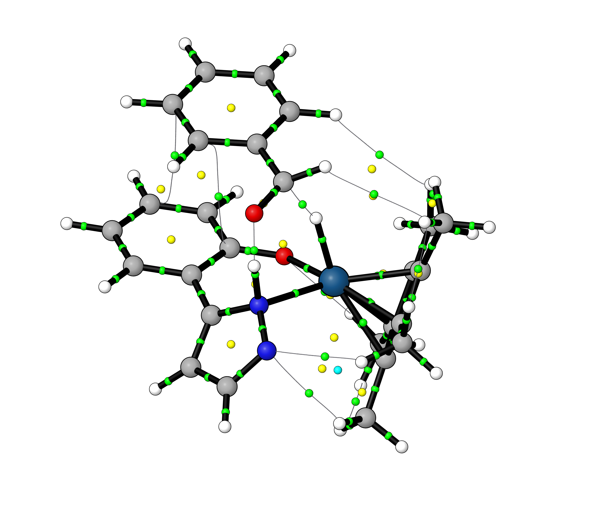
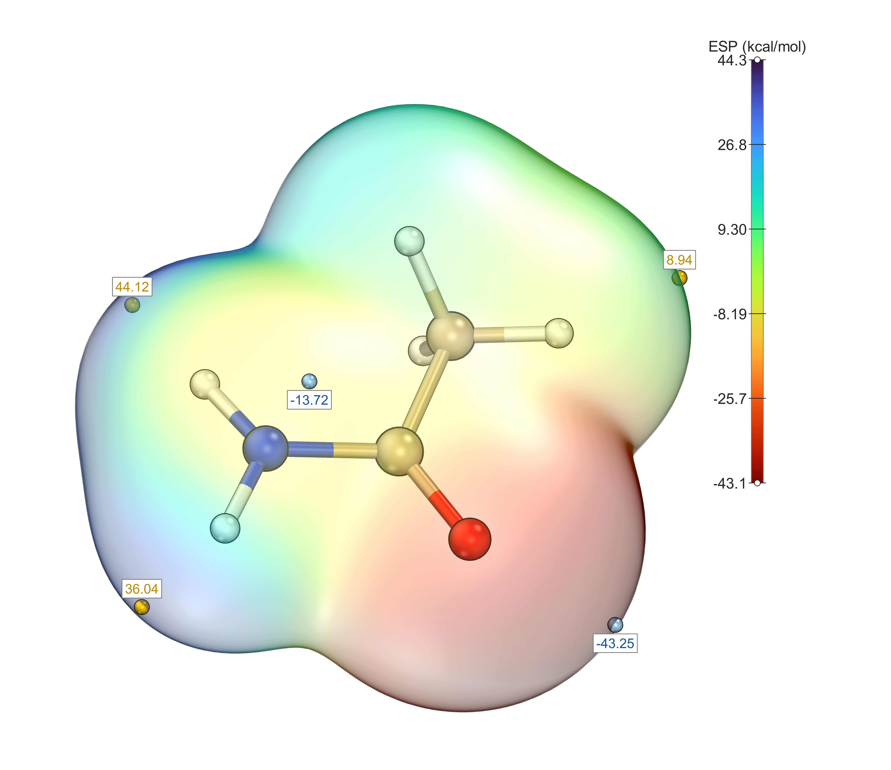

# GXNU MolStudio

<p align="center">
  
  
  
  <a href="https://doi.org/10.5281/zenodo.22821586"></a>
  <a href="https://doi.org/10.26434/chemrxiv.15009253/v2"></a>
</p>

<p align="center">
  <strong>English</strong> · <a href="./README_zh.md">简体中文</a>
</p>

<p align="center">
  <b>Molecular visualization and quantum-chemical analysis — from fchk to publication-ready orbital images in one go.</b>
  <br>
  <sub>Hou Cheng Research Group · Guangxi Normal University</sub>
</p>

---

## Gallery

Publication-style renders — molecular views and quantum-chemistry analysis figures.

<p align="center">
  
  
  
</p>
<p align="center">
  
  
  
</p>

<p align="center">
  <b>Analysis results — IGMH · AIM · ESP</b>
</p>
<p align="center">
  
  
  
</p>

---

## About

GXNU MolStudio is a molecular visualization and quantum-chemistry analysis suite built for computational chemistry research. It integrates an **embedded OpenGL real-time rendering engine**, **Multiwfn wavefunction analysis**, **IGMH/IRI weak-interaction analysis**, **ESP electrostatic potential**, **NBO and charge analysis**, and more — wrapping workflows that used to require manual switching between several programs into a single intuitive GUI.

| Task | Traditional workflow | GXNU MolStudio |
|---|---|---|
| cube generation | type commands by hand | double-click an orbital, auto-generated |
| 3D preview | manually load & tweak isovalues | embedded OpenGL canvas with live sliders |
| rendering | tune lights & materials by hand | one-click styles, instant images |
| weak interactions | run IGMH/IRI separately, then compose | one-click analysis and visualization in-panel |
| batch processing | repeat file-by-file | drag in a folder, fully automated |

---

## Features

### 🧬 Embedded OpenGL rendering engine (ovcanvas)
- **Order-independent transparency compositing (depth peeling)** — correct in-plane transparency sorting across layers; automatic fallback to sorted blending when unavailable
- **One-click styles** — sob-art / IBOview / HoukMol / IQmol default looks, switchable in one click
- **Atom colors × lights, two orthogonal axes** — atom palettes (CPK / SobArt / HoukMol / Vcube …) × lighting rigs (3-light / 1-light / 2-light / 4-light) in any combination
- **Per-light glow** — light dialog for direction / count / glow with fine tuning, save & load
- **Ring rings** — HoukMol-style equatorial great circles; azimuth / elevation adjustable, lockable

### 🔬 Molecule display helpers
- **Hide hydrogens** — hide all H atoms with one click to highlight the heavy-atom skeleton
- **Keep selected H** — enter indices (e.g. `1,3,5-8`) to show only chosen hydrogens
- **Atom indices / element symbols** — label each atom with its in-molecule number or element symbol

### 🧪 IGMH / IRI weak-interaction analysis
- **One-click analysis** — pick fragments, run IGMH or IRI indices through Multiwfn
- **BGR coloring** — sign(λ₂)ρ blue-green-red coloring; isosurface size / opacity sliders plus precise input boxes
- **IGM scatter plots** — embedded scatter-plot viewer

### ⚡ Quantum-chemistry data analysis
- **Orbital browser** — orbital energies, occupations, HOMO/LUMO labels; double-click to generate a cube
- **ESP electrostatic potential** — isosurface + extrema labels + color scale bar
- **NBO analysis** — bond orders, occupations, second-order perturbation E(2) orbital pairs
- **Charge analysis** — Mulliken / fitted charges with bond-order visualization
- **IRC analysis** — track Mayer bond orders and atomic charges along an IRC path, showing each structure live in the shared canvas
- **Distortion–Interaction (DI) analysis** — fragment energy-decomposition with a report and diagram
- **Energetic Span Model (ESM)** — catalytic-cycle analysis: identify TDI/TDTS, compute the energy span δE and TOF, step-shaped energy profiles
- **AIM topology** — QTAIM bond critical points and bond paths from `.wfn` / `.wfx` / fchk input
- **Charge & Mayer bond order** — combined charge-population and bond-order analysis

### 🎬 Legacy VMD / Tachyon rendering (compatibility mode)
- 30+ curated render styles (vcube2.0, in-house and custom)
- High-resolution output (BMP/PNG, 3000+), optional transparent background, shadow/AO control
- Instant Chinese/English toggle, run logs, command-line batch mode

---

## Quick Start

### Requirements

| Component | Purpose | Install |
|------|------|------|
| Python 3.8+ | runtime | [python.org](https://www.python.org/) |
| PyQt5 | GUI | `pip install PyQt5 PyOpenGL PyOpenGL-accelerate` |
| NumPy | numerics | `pip install numpy` |
| PyMCubes | isosurface extraction | `pip install PyMCubes` |
| matplotlib | scatter plots / color bars | `pip install matplotlib` |
| [Multiwfn](http://sobereva.com/multiwfn/) | fchk → cube, IGMH/IRI | download and configure the path |

> VMD / Tachyon are only required for the legacy render mode; the embedded OpenGL canvas does not depend on them.

### Installation

The source code lives on CNB — **[cnb.cool/chem311/GXNU-MolStudio](https://cnb.cool/chem311/GXNU-MolStudio)**, the address given in the preprint — with a mirror at [github.com/houcheng-gxnu/GXNU-MolStudio](https://github.com/houcheng-gxnu/GXNU-MolStudio).

```bash
git clone https://cnb.cool/chem311/GXNU-MolStudio.git
# mirror: git clone https://github.com/houcheng-gxnu/GXNU-MolStudio.git
cd GXNU-MolStudio
pip install -r requirements.txt      # 或：pip install -e . （以包方式安装）
```

### Configure tool paths

On first launch, browse and select the Multiwfn path (and others) in the GUI ⚙️ settings; they are saved automatically to `fchk_orbital.ini`.

### Launch

```bash
# GUI mode (English UI available; 中文内置)
python main.py
```

The GUI ships with four interchangeable layouts — same features, different chrome:

| `--ui` | Layout | Source |
|---|---|---|
| *(default)* / `classic` | classic three-column | `main_window.py` |
| `clean` | Clean Light cards | `main_window_clean.py` |
| `clean2` | Bridge cards | `main_window_clean2.py` |
| `canvas` | **canvas-first**: 58 px icon rail, collapsible right drawer, one-click styles in a dropdown | `main_window_canvas_first.py` |

```bash
python main.py --ui canvas            # or: MOLSTUDIO_UI=canvas python main.py
python main_window_canvas_first.py    # standalone, same result
```

### Command-line mode (batch)

```bash
# Single file, HOMO orbital, sob-art style
python main.py input.fchk --mo h --iso 0.05 --style sob-art

# Batch a folder, HOMO + LUMO
python main.py ./fchk_folder/ --mo h,l --iso 0.05

# Specific orbitals, style, high resolution
python main.py input.fchk --mo h-1,h,l,l+1 --iso 0.04 --style lakers --res 3000,2250

# cube only, no rendering (for debugging)
python main.py ./folder/ --mo h --grid 3 --no-render
```

| Argument | Type | Default | Description |
|------|------|--------|------|
| `input` | str | — | fchk file path or folder path |
| `--mo` | str | `h` | orbitals: `h` (HOMO), `l` (LUMO), `h-1`, numeric indices, comma-separated |
| `--iso` | float | `0.05` | isosurface threshold |
| `--grid` | int | `2` | grid quality: 1=low, 2=medium, 3=high |
| `--style` | str | `sob-art` | render style |
| `--res` | str | `2000,1500` | output resolution `width,height` (`widthxheight` also accepted) |
| `--no-render` | flag | — | generate cubes only, skip rendering |
| `--out` | str | same as input | output directory |

---

### Self-check

```bash
pip install pytest
pytest tests -q      # every submodule imports + offscreen UI smoke test
```

---

## Project Structure

```
GXNU-MolStudio/
├── main.py                  # Thin entry point → molstudio.app:main
├── molstudio/               # Application package
│   ├── app.py               # Startup flow (splash, UI selection, CLI batch mode)
│   ├── paths.py             # Asset / config path resolution (source & frozen)
│   ├── core/                # Backend engine: fchk_orbital, fchk_parser, marching_cubes,
│   │                        #   workers, i18n, crystal_lib
│   ├── ui/                  # Windows & chrome: main_window (+ clean / clean2 /
│   │                        #   canvas-first), dialogs, widgets, ui_icons, theme
│   ├── panels/              # 13 analysis panels + the etsnocv sub-package
│   ├── render/              # ovcanvas GL engine, molcanvas, vmd_embed, viewers
│   └── assets/              # Window icon, university emblem, built-in style json
├── tests/                   # Import self-check + offscreen UI smoke tests
├── docs/                    # Design notes, preprint drafts, reference audits
├── screenshots/             # Gallery images used by this README
├── legacy/                  # Retired code kept for reference (not packaged)
├── OrbitalViewer.spec       # PyInstaller config (onedir)
├── pyproject.toml           # Project metadata & dependencies
└── requirements.txt         # Runtime dependencies
```

---

## Build a Standalone EXE

No Python installation required on the target machine — handy for non-technical users:

```bash
pip install pyinstaller
pyinstaller OrbitalViewer.spec --clean
```

Output: `dist/MolStudio/` (a folder — onedir; double-click `MolStudio.exe` to start).
Everything except the launcher lives in the bundled `_internal/` subfolder, so keep the
folder intact when distributing.

> Packaging already handles 360 Security guard's write interception on a few system DLLs (see comments in the spec).

---

## Acknowledgments

GXNU MolStudio stands on the shoulders of giants:

- **[Multiwfn](http://sobereva.com/multiwfn/)** — the wavefunction analysis program by Prof. Tian Lu (sobereva), cited by over 40,000 papers. Used here to generate cubes and run IGMH/IRI analyses.
- **[vcube 2.0](http://bbs.keinsci.com/thread-18150-1-1.html)** — Tcl scripts for batch rendering Gaussian cube files with VMD, by Prof. Cheng Zhong (Wuhan University); posted on the Computational Chemistry Commune (计算化学公社) forum.
- **[VMD](https://www.ks.uiuc.edu/Research/vmd/)** — Humphrey, W., Dalke, A. and Schulten, K., "VMD: Visual Molecular Dynamics", J. Molec. Graphics, 1996, 14, 33–38.
- **[Tachyon](http://jedi.ks.uiuc.edu/~johns/raytracer/)** — Stone, J. E., "An Efficient Library for Parallel Ray Tracing and Animation", M.Sc. Thesis, 1998.
- **[IboView](https://www.iboview.org)** — the quantum-chemistry visualization program by Gerald Knizia. Its open-source design inspired parts of our renderer; many thanks.

---

## Citation

If GXNU MolStudio helps your research, please cite:

**Software paper (preprint):**

Hou, C. GXNU MolStudio: An Integrated Open-Source Platform for Molecular Visualization and Quantum Chemical Analysis. *ChemRxiv* **2026**. DOI: [10.26434/chemrxiv.15009253/v2](https://doi.org/10.26434/chemrxiv.15009253/v2) (posted 28 September 2026, v2).

```bibtex
@article{Hou2026GXNUMolStudio,
  author  = {Hou, Cheng},
  title   = {GXNU MolStudio: An Integrated Open-Source Platform for Molecular Visualization and Quantum Chemical Analysis},
  journal = {ChemRxiv},
  year    = {2026},
  doi     = {10.26434/chemrxiv.15009253/v2},
  url     = {https://doi.org/10.26434/chemrxiv.15009253/v2},
  note    = {Preprint, v2}
}
```

**Software archive (this release):**

[](https://doi.org/10.5281/zenodo.22821586)

```bibtex
@software{GXNUMolStudio2026,
  title        = {GXNU MolStudio: Molecular Visualization and Quantum Chemical Analysis},
  author       = {Hou, Cheng},
  year         = {2026},
  version      = {1.0.0},
  doi          = {10.5281/zenodo.22821586},
  url          = {https://cnb.cool/chem311/GXNU-MolStudio},
}
```

`10.5281/zenodo.22821586` is the **version DOI**: it always resolves to the v1.0.0 snapshot, so use it when you need to cite exactly this release. To cite the software in general, use the **concept DOI** listed under "Cite all versions?" on the [Zenodo record](https://doi.org/10.5281/zenodo.22821586).

Also cite the corresponding tools from the acknowledgments above. See also [CITATION.cff](./CITATION.cff) and [CITATION.bib](./CITATION.bib).

The software helps with this: the right-hand settings area has two tabs — **Settings** and **Citations**. The *Citations* tab always shows the references required by the function currently selected in the left-hand navigator: the IGMH page, for instance, lists both Multiwfn and the IGMH / IRI papers, each with a note on where it is used. Click **Copy all** to paste the full list into your manuscript. The underlying table lives in [`tab_references.py`](./tab_references.py), with the numbered references matching `docs/chemrxiv_draft.md`.

---

## License

MolStudio is free software distributed under the
**GNU General Public License version 3 (GPLv3)**. See the [LICENSE](./LICENSE) file.

Notes:

- **License version** — some bundled third-party components are licensed
  GPLv3-only, so this project is distributed as **GPLv3-only** (not
  "GPLv3 or later"). Component attributions and license details are listed in
  [THIRD-PARTY-NOTICES](./THIRD-PARTY-NOTICES.md).
- **Citing is a request, not a condition** — the citations above are kindly
  requested for academic work; they are not additional license terms
  (GPLv3 §10 would void them as further restrictions).

Third-party components and their licenses are listed in
[THIRD-PARTY-NOTICES.md](./THIRD-PARTY-NOTICES.md).

---

<p align="center">
  <sub>Made with ❤️ by Hou Cheng Research Group @ Guangxi Normal University</sub>
</p>
