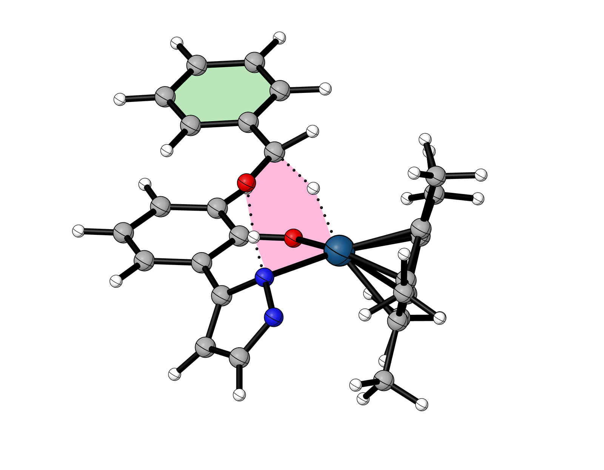
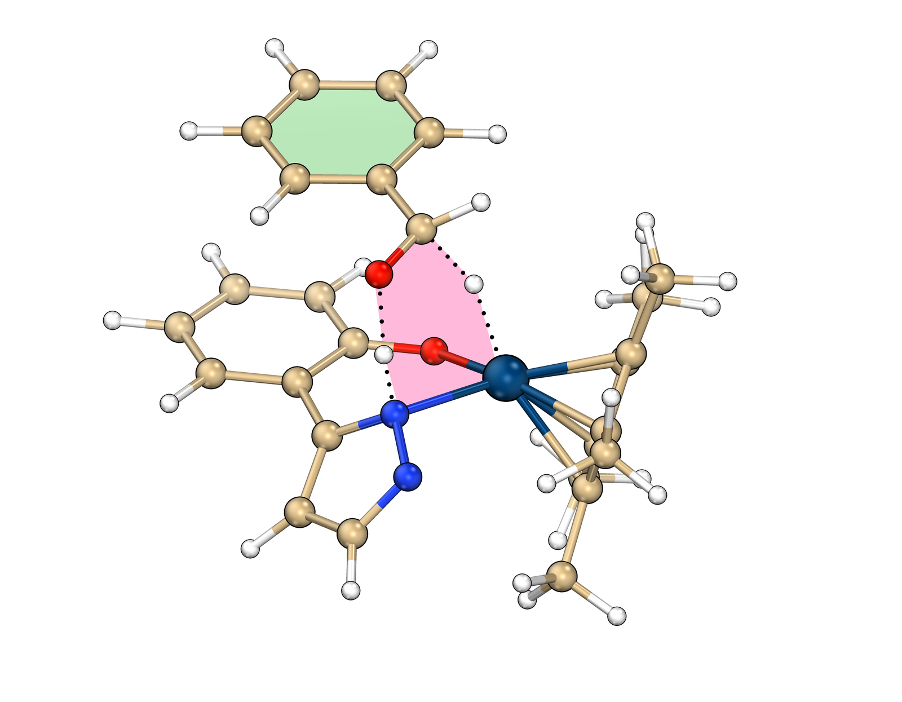
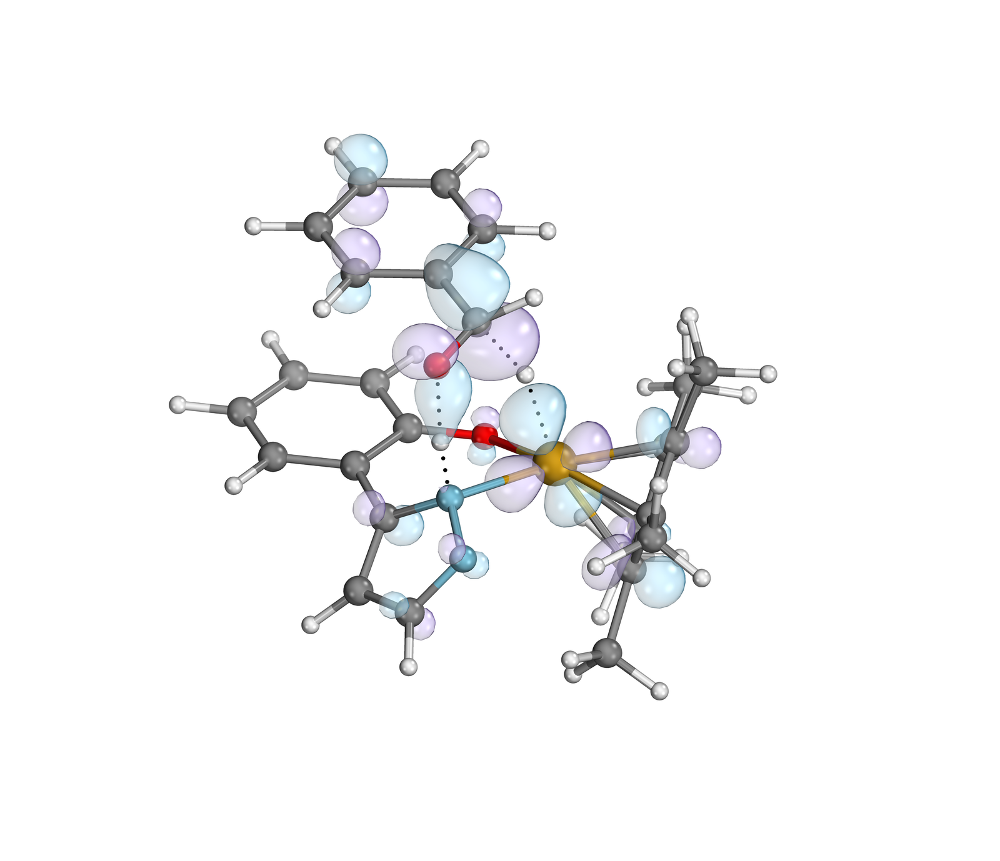
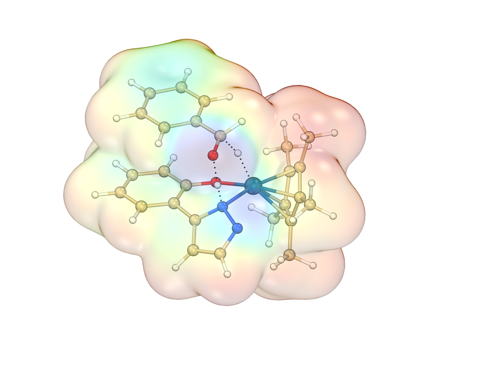
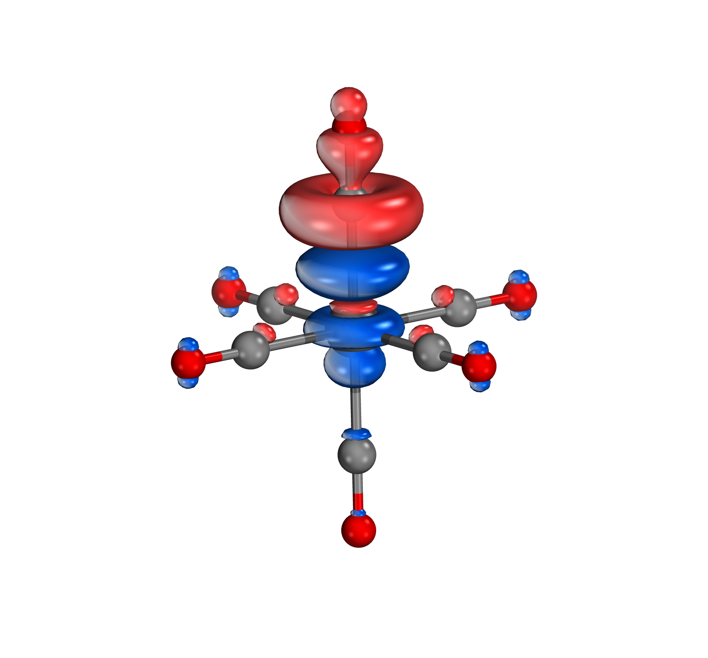
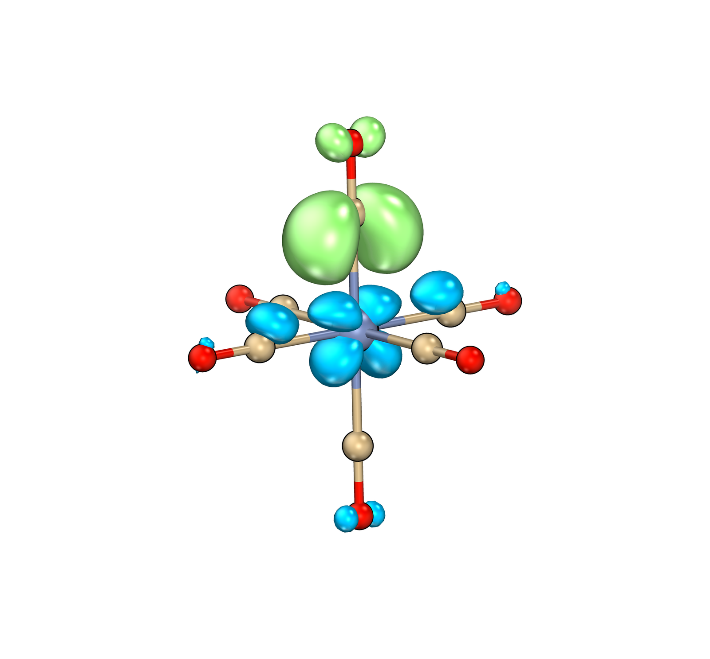
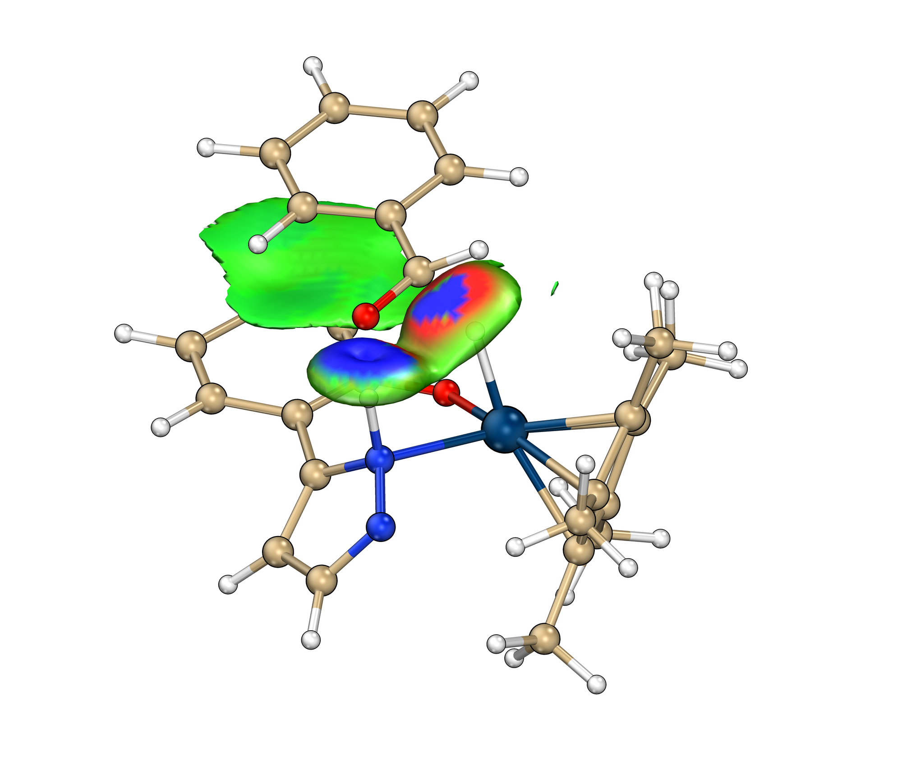
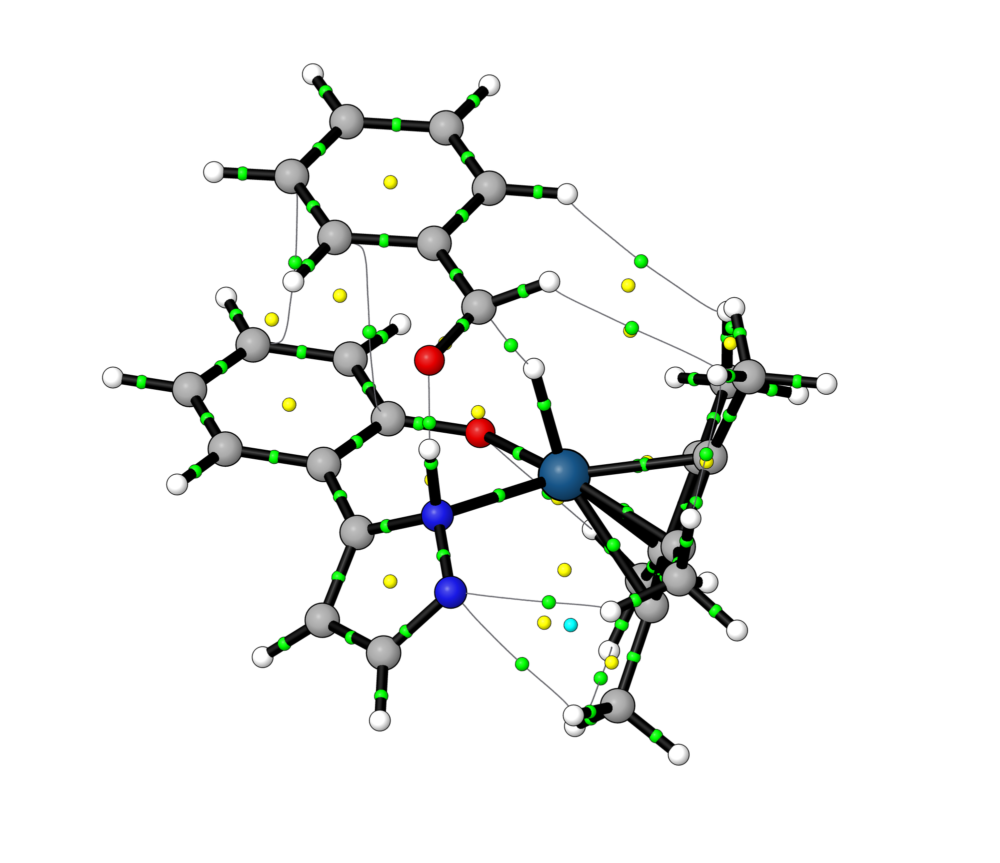
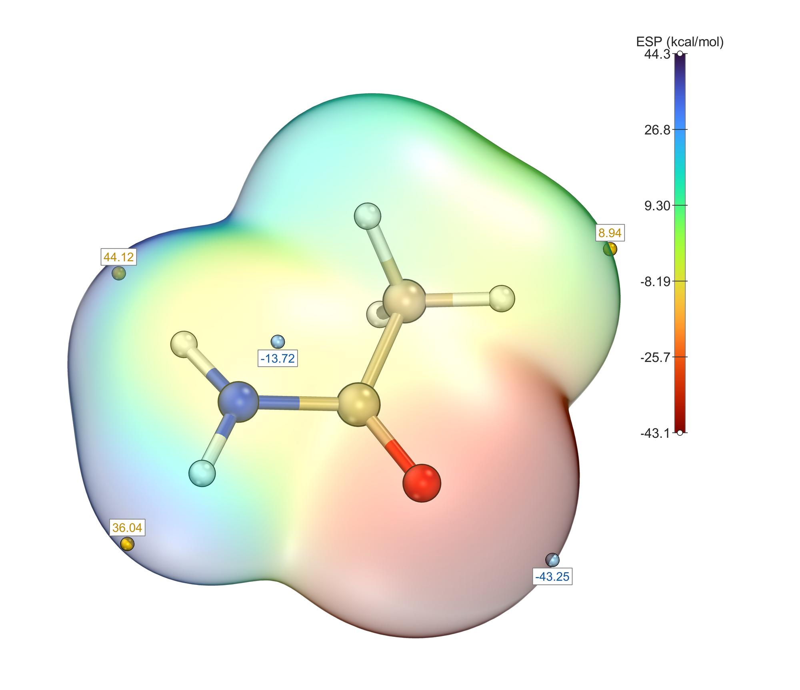

# GXNU MolStudio

<p align="center">
  
  
  
</p>

<p align="center">
  <a href="./README.md">English</a> · <strong>简体中文</strong>
</p>

<p align="center">
  <b>分子可视化与量子化学分析 — 从 fchk 到期刊精美轨道图，一站式完成。</b>
  <br>
  <sub>侯成课题组 · 广西师范大学</sub>
</p>

---

## 界面展示

<p align="center">
  
  
  
</p>
<p align="center">
  
  
  
</p>

<p align="center">
  <b>分析面板</b>
</p>
<p align="center">
  
  
  
</p>

---

## 简介

GXNU MolStudio 是一款面向计算化学研究的分子可视化与量子化学分析软件。它集成了**内嵌 OpenGL 实时渲染引擎**（基于 IboView 管线移植）、**Multiwfn 波函数分析**、**IGMH/IRI 弱相互作用分析**、**ESP 静电势**、**AIM 拓扑**、**IRC / DI / 能量跨度（ESM）分析**、**NBO 与电荷分析**等模块，把传统上需要在多个软件间手动切换的流程封装为直观的图形界面。

| | 传统流程 | GXNU MolStudio |
|---|---|---|
| cube 生成 | 手动输入命令 | 双击轨道自动生成 |
| 3D 预览 | 手动 load、调等值面 | 内嵌 OpenGL 画布，滑块实时调整 |
| 渲染出图 | 手动调灯光、材质 | 一键样式，即时出图 |
| 弱相互作用 | 分开跑 IGMH/IRI 再拼图 | 面板内一键分析并可视化 |
| 批量处理 | 逐个文件重复操作 | 拖入文件夹，全自动批处理 |

---

## 功能特性

### 🧬 内嵌 OpenGL 渲染引擎（ovcanvas）
- **深度剥离透明合成** — IboView 移植管线，多层面内透明正确排序；不可用时自动回退排序混合
- **一键样式** — sob-art / IBOview / HoukMol / IQmol 四种默认观感，一键切换
- **原子配色与光照正交双轴** — 原子配色（CPK / SobArt / HoukMol / Vcube …）× 光照（三光 / 单光 / 双光 / 四光）自由组合
- **每灯独立光晕** — 光源对话框支持方向/数量/光晕精细调节并保存载入
- **十字圆环** — HoukMol 风格球面大圆环，方位/俯仰可调、可锁定

### 🔬 分子显示辅助
- **隐藏氢原子** — 一键隐藏全部 H，突出重原子骨架
- **保留指定 H** — 输入编号（如 `1,3,5-8`），仅显示选中的 H
- **显示原子编号 / 元素符号** — 每个原子旁标注分子内序号或元素符号

### 🧪 IGMH / IRI 弱相互作用分析
- **一键分析** — 选择片段，调用 Multiwfn 计算 IGMH 或 IRI 指标
- **BGR 着色** — sign(λ₂)ρ 蓝-绿-红着色，等值面大小/透明度滑块 + 精确输入框
- **IGM 散点图** — 内嵌散点图查看器

### ⚡ 量子化学数据分析
- **轨道浏览器** — 轨道能量、占据数、HOMO/LUMO 标注，双击自动生成 cube
- **ESP 静电势** — 等值面 + 极值点标注 + 色标条
- **NBO 分析** — 键级、占据、二阶微扰能（E2）轨道对
- **电荷分析** — Mulliken / 拟合电荷、键级可视化
- **IRC 分析** — 沿反应路径追踪 Mayer 键级与原子电荷变化，共享画布实时显示对应结构
- **Distortion–Interaction（DI）分析** — 片段能量分解，附分析报告与示意图
- **Energetic Span Model（ESM）** — 催化循环分析：识别 TDI/TDTS，计算能量跨度 δE 与 TOF，绘制台阶式能量剖面
- **AIM 拓扑** — 基于 `.wfn` / `.wfx` / fchk 输入的 QTAIM 键临界点（BCP）与键径分析
- **电荷与 Mayer 键级** — 电荷布居与 Mayer 键级组合面板

### 🎬 传统 VMD / Tachyon 渲染（兼容模式）
- 30+ 预置渲染风格（vcube2.0、IboView、原创精选）
- 高分辨率输出（BMP/PNG，3000+）、可选透明背景、阴影/AO 控制
- 中英双语即时切换、运行日志、命令行批处理

---

## 快速开始

### 环境要求

| 组件 | 用途 | 安装 |
|------|------|------|
| Python 3.8+ | 运行环境 | [python.org](https://www.python.org/) |
| PyQt5 | GUI 界面 | `pip install PyQt5 PyOpenGL PyOpenGL-accelerate` |
| NumPy | 数值计算 | `pip install numpy` |
| PyMCubes | 等值面提取 | `pip install PyMCubes` |
| matplotlib | 散点图/色标 | `pip install matplotlib` |
| [Multiwfn](http://sobereva.com/multiwfn/) | fchk → cube、IGMH/IRI | 下载后配置路径 |

> VMD / Tachyon 仅传统渲染模式需要；内嵌 OpenGL 画布不依赖它们。

### 安装

```bash
git clone https://github.com/houcheng-gxnu/GXNU-MolStudio.git
cd GXNU-MolStudio
pip install PyQt5 PyOpenGL numpy PyMCubes matplotlib
```

### 配置工具路径

首次启动时在 GUI ⚙️ 设置中浏览选择 Multiwfn 等路径，自动保存到 `fchk_orbital.ini`。

### 启动

```bash
# GUI 模式（默认中文；内置英文界面）
python main.py
```

### 命令行模式（批处理）

```bash
# 单个文件，HOMO 轨道，sob-art 风格
python main.py input.fchk --mo h --iso 0.05 --style sob-art

# 批量处理文件夹，HOMO + LUMO
python main.py ./fchk_folder/ --mo h,l --iso 0.05

# 指定轨道、风格、高分辨率
python main.py input.fchk --mo h-1,h,l,l+1 --iso 0.04 --style lakers --res 3000,2250

# 仅生成 cube，不渲染（用于调试）
python main.py ./folder/ --mo h --grid 3 --no-render
```

| 参数 | 类型 | 默认值 | 说明 |
|------|------|--------|------|
| `input` | str | — | fchk 文件路径或文件夹路径 |
| `--mo` | str | `h` | 轨道选择：`h` (HOMO)、`l` (LUMO)、`h-1`、数字编号、逗号分隔 |
| `--iso` | float | `0.05` | 等值面阈值 |
| `--grid` | int | `2` | 网格质量：1=低, 2=中, 3=高 |
| `--style` | str | `sob-art` | 渲染风格 |
| `--res` | str | `2000,1500` | 输出分辨率 `宽,高`（也支持 `宽x高`） |
| `--no-render` | flag | — | 仅生成 cube，不渲染 |
| `--out` | str | 输入同目录 | 输出目录 |

---

## 项目结构

```
GXNU-MolStudio/
├── main.py                  # 入口（GUI 启动 + 命令行批处理）
├── main_window.py           # 主窗口（UI 布局、面板集成、日志）
├── ovcanvas/                # 内嵌 OpenGL 渲染引擎（IboView 管线移植）
│   ├── _glwidget.py         # GL 渲染核心（深度剥离/光照/球棍/等值面）
│   ├── _panel.py            # 画布面板（一键样式/参数/光源/圆环）
│   ├── _colorwheel.py       # IboView 风格色轮
│   └── _molviewer_style.py  # MolViewer 预设
├── etsnocv/                 # ETS-NOCV 分析子包
├── igmh_panel.py            # IGMH/IRI 弱相互作用分析面板
├── irc_panel.py             # IRC 面板：沿路径的 Mayer 键级 / 电荷追踪
├── esp_panel.py             # ESP 静电势分析面板
├── aim_panel.py             # AIM 拓扑分析（QTAIM BCP 与键径）
├── charge_bond_panel.py     # 电荷 + Mayer 键级组合面板
├── charge_viewer.py         # 电荷分析查看器
├── nbo_viewer.py            # NBO 分析查看器
├── di_analysis_panel.py     # Distortion–Interaction 能量分解
├── energy_span_panel.py     # Energetic Span Model（能量跨度 δE / TOF）
├── fchk_orbital.py          # 后端引擎（cube 生成、VMD 控制、Tachyon 渲染、风格定义）
├── fchk_parser.py           # fchk 解析
├── marching_cubes.py        # 等值面提取（PyMCubes 封装）
├── file_dialogs.py          # 文件对话框（记住上次目录）
├── i18n.py                  # 国际化（中 / English）
├── theme.py                 # QSS 主题
├── workers.py               # 后台工作线程
├── OrbitalViewer.spec       # PyInstaller 打包配置（onedir）
├── screenshots/             # 展示截图
├── README.md                # English（默认）
└── README_zh.md             # 简体中文
```

---

## 打包为独立 EXE

无需安装 Python 即可运行，适合分发给非技术用户：

```bash
pip install pyinstaller
pyinstaller OrbitalViewer.spec --clean
```

输出：`dist/GXNU MolStudio/`（文件夹形式，双击 `GXNU MolStudio.exe` 启动）。

> 打包时已处理 360 安全卫士对个别系统 DLL 的写入拦截（见 spec 内注释）。

---

## 致谢

GXNU MolStudio 站在巨人的肩膀上：

- **[Multiwfn](http://sobereva.com/multiwfn/)** — 卢天老师开发的量子化学波函数分析程序，引用超 4 万篇论文。本项目使用其生成 cube、执行 IGMH/IRI 分析。
- **[vcube2.0](https://github.com/Zhong-Cheng-2020/vcube2.0)** — 钟成老师提供的多套精美 VMD 轨道渲染配置。
- **[VMD](https://www.ks.uiuc.edu/Research/vmd/)** — Humphrey, W., Dalke, A. and Schulten, K., "VMD: Visual Molecular Dynamics", J. Molec. Graphics, 1996, 14, 33–38.
- **[Tachyon](http://jedi.ks.uiuc.edu/~johns/raytracer/)** — Stone, J. E., "An Efficient Library for Parallel Ray Tracing and Animation", M.Sc. Thesis, 1998.
- **[IboView](https://www.iboview.org)** — Gerald Knizia 开发的量子化学可视化程序。本项目的 OpenGL 渲染引擎（深度剥离透明合成、Phong 光照、球棍模型几何与原子半径/颜色表）参考并部分移植自 IboView（Copyright (c) 2015 Gerald Knizia, GPLv3），特此致谢。

---

## 引用

如果 GXNU MolStudio 对你的研究有帮助，请在论文中引用：

```bibtex
@software{GXNUMolStudio2026,
  title        = {GXNU MolStudio: Molecular Visualization and Quantum Chemical Analysis},
  author       = {Hou Cheng},
  year         = {2026},
  version      = {1.0},
  url          = {https://github.com/houcheng-gxnu/GXNU-MolStudio},
}
```

同时请引用上述致谢中的对应工具文献。另见 [CITATION.cff](./CITATION.cff) 和 [CITATION.bib](./CITATION.bib)。

---

## 许可证

本项目作为 IboView 的衍生作品，依 **GNU General Public License version 3（GPLv3-only）** 发布，
详见 [LICENSE](./LICENSE) 文件。

两点说明：

- **是 GPLv3-only，不是 "or later"** —— IboView（Copyright (c) 2015 Gerald Knizia）为
  **GPLv3-only**，故本项目在仍含其代码时不得改称 "GPLv3 或更高版本"。
- **引用是请求，不是许可条件** —— 上文引用文献是学术层面的恳请，不构成附加许可条款
  （作为许可条件会因 GPLv3 §10 而无效）。

第三方组件及其许可证详见 [THIRD-PARTY-NOTICES.md](./THIRD-PARTY-NOTICES.md)。

---

<p align="center">
  <sub>Made with ❤️ by Hou Cheng Research Group @ Guangxi Normal University</sub>
</p>
