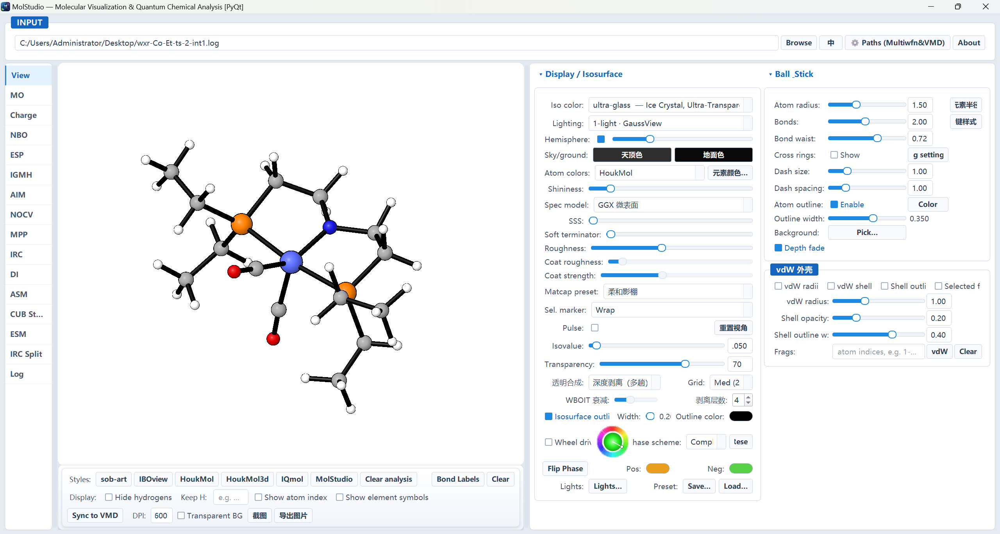

# GXNU MolStudio: An Integrated Open-Source Platform for Molecular Visualization and Quantum Chemical Analysis

<!-- ══════════════════════════════════════════════════════════════════
     ChemRxiv preprint draft — GXNU MolStudio v1.0 (2026)
     Status: 正文与参考文献已定稿；待插图与图注。
     ── 提交前必填（作者提供）─────────────────────────────────────
     [x] 作者姓名 / 单位 / ORCID / 通讯邮箱（Cheng Hou，单一作者）
     [x] 基金资助信息（NSFC 22463001）
     [ ] 图 2–6 截图替换占位
     [x] 参考文献已按作者 2026-09-18 审计逐条修订（详见文末清单）
     [x] 5 处方法原文引用已插入（Mayer[19] / NBO[20] / ESP[21] / QTAIM[22] / IRC[23]）
     ── 已于 2026-09-03 完成（依据代码审计结果核对）───────────────
     [x] §4.2 补 ADCH 引用 [14]
     [x] §4.10 补 DI 引用 [13]（Bickelhaupt–Houk 表述）
     [x] §2.1 补「为何外部进程调用 Multiwfn 而非重实现」设计取舍段
     [x] 元素配色表已从 IboView 换成 Jmol/CPK → §2.1 / §7 表述已更正
     [x] Ref 4 改为 IBO 方法原文（原为 KoehnLab fork，已移至 Ref 19）
     [x] 新增 Ref 17（IRI 原文）、18（Knizia & Klein 2015）
     [x] Data Availability 补入已公开的 GitHub 地址
     [x] §7 补入课题组在先工作自引（Ref 15 IGMH_Toolbox、16 ChargeViewer）
     [x] §7 补入 Eming 的 draw_bond Tcl 署名
     [x] 全文统一为 GPLv3-only（与 CITATION.cff 一致）
     ══════════════════════════════════════════════════════════════════ -->

**Authors:** Cheng Hou<sup>1,*</sup>

<sup>1</sup> School of Chemistry and Pharmaceutical Sciences, Guangxi Normal University, Guilin 541004, P. R. China

<sup>*</sup> Correspondence: houcheng@gxnu.edu.cn; ORCID: 0000-0003-2967-0326

**Keywords:** molecular visualization; wavefunction analysis; graphical user interface; quantum chemistry; Multiwfn

---

## Abstract

We present **GXNU MolStudio**, an open-source, bilingual (Chinese/English) desktop application that unifies real-time molecular visualization with a broad suite of quantum chemical analyses inside a single interactive environment. MolStudio embeds a custom OpenGL 3.3 renderer that displays molecules, orbitals, and property-colored isosurfaces with publication-oriented styling, and couples it with scripted invocations of the external wavefunction-analysis program Multiwfn. The current release provides fourteen panels — eleven analysis panels and three workflow panels — covering orbital browsing and isosurface generation (with spin-density visualization for open-shell systems), six atomic-charge schemes (ADCH, Hirshfeld, Mulliken, CM5, SCPA, VDD), Mayer bond orders, NBO donor–acceptor (E(2)) analysis, electrostatic-potential (ESP) surfaces with extrema and area distribution, IGMH/IRI weak-interaction analysis, QTAIM topology, ETS-NOCV energy decomposition, molecular planarity (MPP), IRC energy/bond-order profiling, distortion–interaction (DI) decomposition, the Energetic Span Model (ESM), activation-strain scanning along an IRC, multi-cube overlay, and IRC splitting into per-point inputs. All panels share a single canvas and an atomic-picking protocol, so that results from different analyses are immediately comparable on the same structure. A legacy VMD/Tachyon channel provides ray-traced, journal-grade images with more than thirty curated styles. MolStudio is distributed as Python source (PyQt5, Python ≥ 3.8) and as a standalone Windows executable under the GNU General Public License v3.0 (GPLv3-only). Its rendering pipeline is a Python port of the GPLv3-licensed IboView engine — a derivation that is stated explicitly in Section 7 and documented item-by-item in the repository — and all third-party components are acknowledged. The software is freely available at https://cnb.cool/chem311/GXNU-MolStudio.

---

## 1. Introduction

Quantum chemical calculations are now routine in chemistry, yet the translation of raw outputs — formatted checkpoint (`.fchk`) files, Gaussian cube grids, and log files — into chemically meaningful insight still requires a patchwork of tools. Visualizers such as VMD,[1] Avogadro,[2] IboView,[3,4] and GaussView display structures and isosurfaces, whereas quantitative analyses (atomic charges, bond orders, NBO interactions, ESP surfaces, weak interactions, QTAIM topology, energy decompositions) are performed by dedicated programs, most prominently Multiwfn.[5,6] Reproducing a literature-style figure or answering a mechanistic question typically forces the researcher to move data between several interfaces, manually match geometries and orbital indices, and restyle the same scene several times.

Several capable toolsets exist for individual analyses — for example, the IGMH/IRI method and its accompanying toolbox,[7,8] ETS-NOCV viewers,[9] and ESP surface viewers. What is still missing for many research groups and teaching laboratories is a single, low-friction environment in which a molecule loaded once can be examined with any of these methods without re-importing geometry, and in which every numerical result has an immediate graphical counterpart that can be exported directly for a manuscript.

GXNU MolStudio, developed in the Hou Cheng research group at Guangxi Normal University, was designed to fill this gap. Its guiding principles are:

1. **One canvas, many analyses.** All structures, orbitals, isosurfaces, and color-mapped properties are drawn in a single embedded OpenGL viewport. Every analysis panel operates on that same canvas, so a user can, for example, overlay an ESP surface, identify its extrema, and immediately interrogate the corresponding NBO interaction or QTAIM critical point without reloading anything.
2. **Multiwfn as the computation engine.** Wherever a wavefunction-derived quantity is required, MolStudio drives Multiwfn through scripted command sequences, automating cube generation and property evaluation while preserving control over grid quality and file management. Users interact with chemistry, not with console prompts.
3. **Publication-oriented output.** Every module can export figures (PNG/SVG/PDF), data (CSV), or formatted reports (HTML). A compatibility channel to VMD/Tachyon supplies high-resolution ray-traced images with curated color and lighting presets for journal covers and figures.

MolStudio is bilingual (Chinese/English with instant switching), accepts drag-and-drop input, supports a command-line batch mode, and is packaged as a standalone Windows executable for users without a Python environment. It is released under the GNU General Public License v3.0 (GPLv3-only; Section 7).

## 2. Software Architecture

### 2.1 Technology stack

MolStudio is written in Python 3.8+ using the Qt5 bindings PyQt5 for the graphical interface and matplotlib for embedded charts. The real-time viewport is an OpenGL 3.3 Core renderer (PyOpenGL) that renders ball-and-stick models and isosurfaces with Phong-style lighting, per-element color tables, depth peeling for order-independent transparency of translucent surfaces (with an automatic fallback to depth-sorted blending), and an in-canvas, user-draggable color scale bar. The rendering engine is a **Python port of the IboView[3,4] pipeline** (depth-peeling transparency, three-light Phong shading, ball-and-stick geometry, and IboView's atomic-radii and covalent-radii tables). The element-colour palette, which was likewise taken from IboView in the initial port, has since been replaced by the public Jmol/CPK set as part of an ongoing de-derivatization effort (Section 7). IboView is copyrighted by Gerald Knizia and distributed under GPLv3; MolStudio therefore constitutes a derivative work of IboView and is distributed under the same licence (see Section 7 and the third-party notices in the repository).

Grid data are parsed by a native Gaussian-cube reader, and isosurface meshes are extracted with PyMCubes through a thin local wrapper (`marching_cubes.py`) that also computes vertex normals. All heavy numerical tasks run in worker threads (`QThread`) with progress reporting, and worker processes can be cancelled cleanly.

The analysis backend is the external program **Multiwfn** (version 3.8, released on 2026-01-07, and the subsequent date-versioned releases; the current development cycle has been tested against the 2026.4.10 build),[5,6] whose location is configured once in a settings dialog and stored in `fchk_orbital.ini`. The legacy publication channel optionally uses VMD[1] and the Tachyon ray tracer;[10] these are required only for that channel and never for the built-in canvas.

**Why Multiwfn is invoked rather than re-implemented.** Every wavefunction-derived quantity in MolStudio is obtained by driving Multiwfn as an external process, rather than by re-implementing the underlying algorithms inside MolStudio. Three considerations motivated this choice. First, it guarantees that any number displayed by the MolStudio interface is identical to the value produced by the reference implementation that the community already validates and cites, so results obtained through the GUI are directly comparable with the literature and require no separate verification. Second, the analysis backend thereby tracks Multiwfn updates — new charge definitions, new real-space functions, revised defaults — without any change to MolStudio itself. Third, it avoids silently diverging from the reference in edge cases (open-shell treatments, effective core potentials, integration-grid choices) where subtle implementation differences are easy to introduce and difficult to detect. The cost of this design is that Multiwfn must be installed separately: it is invoked as a separate process, is not redistributed with MolStudio, and its own terms govern its use (Section 7).

### 2.2 Program layout

The main window is composed of three regions (Figure 1): a left navigation rail listing the panels, a central canvas column, and a right-hand stack containing the active analysis panel. A draggable splitter separates the canvas from the panel stack, and the navigation list and stack remain synchronized. All panels receive the same `glw` handle and register atom-pick callbacks, which gives rise to behaviors such as "click an atom to query its charge, select it for a bond-order calculation, or add it to an IGMH fragment" consistently across modules.

```
┌──────────┬──────────────────────────┬───────────────────────────────┐
│  nav     │                          │   Visualization (orbital      │
│  rail    │      OpenGL canvas       │   table, iso settings)        │
│  (tabs)  │      (shared glw)        │   Charges & bond orders       │
│          │                          │   NBO / ESP / IGMH / AIM      │
│          │                          │   ETS-NOCV / MPP / IRC        │
│          │                          │   DI / Energy span / Spin     │
│          │                          │   Run log                     │
└──────────┴──────────────────────────┴───────────────────────────────┘
```

{ width=6.5in }

**Figure 1.** The GXNU MolStudio workspace: navigation rail (left), the shared OpenGL canvas (centre), and the active analysis panel (right). The panel organisation is summarised in the schematic above.

The codebase is deliberately modular: `main.py` (entry point, splash screen, CLI batch mode), `main_window.py` (application shell and panel orchestration), `fchk_orbital.py` (cube generation, style presets, VMD/Tachyon control), the `ovcanvas/` package (OpenGL renderer and canvas panel), `marching_cubes.py` (cube parsing and isosurface extraction), plus one module per analysis panel (`charge_bond_panel.py`, `nbo_viewer.py`, `esp_panel.py`, `igmh_panel.py`, `aim_panel.py`, `etsnocv_panel.py`, `mpp_panel.py`, `irc_panel.py`, `di_analysis_panel.py`, `energy_span_panel.py`). Shared parsers convert `.fchk`, `.log/.out`, `.cub/.cube`, `.xyz`, and Molden inputs into a common atom/bond representation used by the canvas and all panels. Spin-density visualization lives inside the orbital panel, driven by a dedicated worker thread.

### 2.3 Responsiveness and startup

Long-running Multiwfn tasks run in worker threads with progress emission into a shared run log and a progress bar; all external processes can be interrupted. To eliminate the well-known first-interaction latency caused by shader just-in-time compilation, MolStudio compiles all GLSL shaders during the splash screen before the main window becomes interactive.

## 3. Visualization Capabilities

### 3.1 Interactive OpenGL canvas

The embedded canvas offers:

- **Curated view styles.** One-click presets reproduce the visual conventions of sob-art, IBOview, HoukMol, and IQmol aesthetics; per-atom color schemes (CPK, SobArt, HoukMol, Vcube, custom) combine with orthogonal light setups (one to four lights, each with adjustable halos).
- **Correct transparency.** Depth peeling renders overlapping translucent isosurfaces without the artifacts of naive alpha blending; when depth peeling is unavailable, MolStudio falls back to depth-sorted blending.
- **Molecular display helpers.** Hydrogen hiding with "keep specified H" options, per-atom serial-number or element-symbol labels, a Houk-style crosshair ring on the molecular plane, and full rotation/pan/zoom interaction.
- **Property coloring.** Atomic charges mapped onto a diverging color scale; per-atom signed deviations (e.g., MPP planarity); vertex-colored isosurfaces for ESP and IGMH fields; an in-canvas color scale bar that can be repositioned and customized.
- **Atomic picking.** Clicking an atom highlights it and triggers the relevant analysis (charge lookup, bond selection, fragment definition) in the active panel; Shift+left-drag provides rubber-band fragment selection for IGMH-style analyses.

### 3.2 Legacy VMD/Tachyon channel

For ray-traced, publication-grade images, MolStudio retains a compatibility channel that scripts VMD[1] with more than thirty curated color/material/lighting presets (adapted from the vcube 2.0 style collections[11] and IboView-style configurations[3]) and renders final images with the Tachyon ray tracer[10] at arbitrarily high resolution (tested above 3000 px), with optional transparent backgrounds. All VMD interactions — molecule loading, styling, camera control, rendering — are scripted from MolStudio, and an optional "sync to VMD" button mirrors the in-canvas view, allowing the user to refine the OpenGL scene and produce an equivalent VMD figure without re-doing the setup.

## 4. Analysis Modules

MolStudio ships with fourteen panels — eleven analysis panels and three workflow panels. Each either reads the currently loaded molecule or its own input files, performs the analysis (usually by scripting Multiwfn), and presents both numerical results and an immediate update of the canvas or an embedded chart. This section summarizes each module; method-level literature is collected in the References.

### 4.1 Orbital browser and isosurface generation

Formatted checkpoint files are parsed into an orbital-energy table with occupation numbers and HOMO/LUMO markers. Double-clicking any orbital generates its cube grid through Multiwfn and renders the isosurface in the canvas with conventional positive/negative lobe coloring; several orbitals (e.g., HOMO and LUMO) can be displayed simultaneously with independent colors. A command-line batch mode (`python main.py folder/ --mo h,l --iso 0.05 --style sob-art`) automates cube generation and rendering over whole directories, and an embedded renderer or the VMD/Tachyon channel can produce the final figures.

### 4.2 Atomic charges and bond orders

The charge panel computes six widely used atomic charge schemes — **ADCH**,[14] Hirshfeld, Mulliken, CM5, SCPA, and VDD[5,6] — by scripting Multiwfn, displays them in a sortable table, and exports CSV. Charges can be mapped onto atoms in the canvas using a diverging blue–white–red scale whose direction is user-adjustable. The companion bond-order panel computes **Mayer bond orders**[19] for user-selected atom pairs (by picking atoms or typing indices). Both panels register atom-pick behavior on the shared canvas.

### 4.3 NBO analysis

Reading Gaussian `pop=nbo` log output, and following the natural bond orbital donor–acceptor picture,[20] the NBO panel lists natural orbitals with occupations and the E(2) second-order perturbative donor–acceptor interactions (donor/acceptor pairs and energies in kcal mol⁻¹). NBO levels are matched to molecular-orbital indices from the accompanying `.fchk`, so any NBO orbital can be generated on demand and displayed as an isosurface on the shared canvas.

### 4.4 ESP surfaces and extrema

Starting from a `.fchk`, and following the standard interpretation of the molecular electrostatic potential,[21] MolStudio generates electron-density and ESP cube grids with Multiwfn, extracts the van der Waals isosurface (default ρ = 0.001 a.u.) from the density field, and colors it continuously by the ESP value sampled at each vertex. Four display modes are available: **ISO** (isosurface mesh), **PT** (vertex-colored point cloud), **EXT** (extrema markers; gold spheres = local maxima, light blue = local minima), and **ALL** (surface + extrema). The default diverging colormap is RWB (red = negative ESP, i.e., electron-rich regions; blue = positive ESP, i.e., electron-poor regions), following the convention common in textbooks and the chemical literature; an **invert-colors** toggle reverses the direction of any selected colormap, and a library of diverging and sequential scales (BWR, Coolwarm, Seismic, RdBu, Turbo and other rainbow variants, Viridis, Plasma, Cividis, IceFire) is provided. An in-canvas color scale bar, an automatic ESP-extrema range detector, an ESP surface-area distribution histogram, and multi-molecule overlay charts complete the module. Pairs of precomputed cube files (`density*.cub` / `ESP*.cub`) can be loaded and rendered directly without re-running Multiwfn.

### 4.5 IGMH / IRI weak-interaction analysis

Fragments are defined by clicking atoms on the canvas (Shift+left-drag rubber-band selection) or by typing atom ranges (e.g., "1–12,15"). Scripted Multiwfn runs produce the `dg_inter`, `dg_intra`, `dg`, and `sl2r` cube grids for either the IGMH or the IRI indicator. The inter-fragment `dg_inter` field defines the geometry of the weak-interaction isosurface, which is colored by the sign(λ₂)ρ field with the BGR scale (blue = attractive, green = weak, red = repulsive), reproducing the standard IGMH visualization. An interactive IGM Map scatter plot (sign(λ₂)ρ vs δg) with PNG export accompanies the isosurface. The IGMH and IRI indicators follow Lu and Chen.[7,16]

### 4.6 QTAIM topology (AIM)

Within the Quantum Theory of Atoms in Molecules (QTAIM),[22] MolStudio drives Multiwfn through a complete topological analysis (critical-point search and bond-path following), colors critical points by type, and draws bond paths into the canvas as point clouds. Clicking a critical point queries its properties (ρ, ∇²ρ, kinetic/energy densities, ellipticity, etc.). A VMD/Tachyon "journal preview" mode renders the topology for final figures.

### 4.7 ETS-NOCV energy decomposition

Given a complex and its two fragments (three `.fchk` files), the ETS-NOCV panel runs a persistent Multiwfn session to perform the ETS-NOCV energy decomposition and lists the NOCV pair table (ΔE_pair, orbital labels, eigenvalues, energies). Selecting a pair generates the corresponding deformation-density cube on demand and displays the positive/negative lobes on the canvas with a user-selectable blue–red phase convention. A Gaussian `.gjf` input generator assists in preparing the fragment and complex calculations.

### 4.8 Molecular planarity parameters (MPP)

The MPP panel accepts molecular files (fchk/log/out/wfn/pdb/xyz; log files are converted to XYZ internally for Multiwfn), selects atoms on the canvas or by index ranges, and invokes Multiwfn's MPP subroutine to obtain the molecular planarity parameter and the signed plane-deviation span (SDP, in Å).[24] Atoms are colored in the canvas (and optionally in VMD) by their signed distance from the fitted plane using a ±0.5 Å diverging scale (below-plane blue, in-plane white, above-plane red).

### 4.9 IRC energy and bond-order profiling

Given a directory of intrinsic-reaction-coordinate (IRC)[23] point `.fchk` files, the IRC panel batch-extracts total energies and computes Mayer bond orders[19] for chosen atom pairs at every point via Multiwfn (results are cached by an MD5 of the file path, so repeated analyses are instantaneous). A dual-axis matplotlib chart plots bond order (left axis) and energy (right axis) versus the reaction coordinate; individual points are clickable and load the corresponding IRC structure onto the canvas. Bond-order/charge lists are editable, the legend is draggable, and chart settings (title, axis labels, grid, energy fill) are fully configurable. Multiple charge curves (any of the six charge types) can be overlaid and are mutually exclusive with bond-order curves for clarity. CSV and PNG exports are provided.

### 4.10 Distortion–interaction (DI) decomposition

From five Gaussian `.log` files (the two optimized fragments, the two fragments at the transition-state geometry, and the TS complex), the DI panel parses SCF energies (with optional ZPE or Gibbs corrections from frequency calculations) and performs the distortion/interaction—activation-strain analysis in the formulation of Bickelhaupt and Houk:[13] it computes the distortion energies ΔE_strain,1 and ΔE_strain,2, the interaction energy ΔE_int, and the total activation energy ΔE‡ = ΔE_strain + ΔE_int, and presents them in a color-coded table (Hartree and kcal mol⁻¹) together with the classic DI energy-ladder arrow diagram and a decomposition bar chart. Any of the five structures can be displayed on the canvas, and a formatted HTML report is exported.

### 4.11 Energetic Span Model (ESM)

The Energy Span panel implements the Kozuch–Shaik energetic-span analysis of catalytic cycles.[12] The user enters the Gibbs energies (ΔG, kcal mol⁻¹) of each cycle species — intermediates and transition states — together with the temperature; the panel identifies the turnover-determining intermediate (TDI) and transition state (TDTS), computes the energetic span δE and the turnover frequency TOF = (k_BT/h)·exp(−δE/RT), and draws the stepwise free-energy profile with the energetic-span arrow, including automatic double-cycle handling when the TDTS precedes the TDI. Charts export to PNG, SVG, and PDF.

### 4.12 Spin-density visualization

For open-shell systems, the orbital panel provides a dedicated spin-density action that computes the α−β spin-density cube via Multiwfn and visualizes the result as isosurfaces, with the full set of colormap, style, isovalue, and export controls of the orbital pipeline.

### 4.13 Activation-strain (ASM) scanning along an IRC

The ASM panel applies the distortion–interaction decomposition of Section 4.10 at *every* point of an intrinsic reaction coordinate, rather than at the single transition-state geometry. Given the two optimized reference fragments plus, for each IRC point, the complex and its two fragments at that geometry, it evaluates

  ΔE_strain(i) = [E_def,A(i) − E_opt,A] + [E_def,B(i) − E_opt,B]
  ΔE_int(i)    = E_complex(i) − E_def,A(i) − E_def,B(i)
  ΔE(i)        = ΔE_strain(i) + ΔE_int(i)

using the same energy convention as the DI panel (electronic energy alone, or with ZPE or Gibbs corrections), and plots the three curves against the reaction coordinate. The reference states are entered as their own optimized logs, the IRC point list can be filled automatically by scanning a directory, and the figure settings (curves, markers, line styles, legends, peak annotations, export DPI) follow the ESP distribution chart.

### 4.14 Multi-cube overlay

The CUB Stack panel loads several Gaussian cube files and superimposes their isosurfaces on a single structure — the atomic geometry being taken from the first enabled cube — so that different properties of the same system (several molecular orbitals, spin density, density differences) can be compared in one scene. Isovalue and opacity are shared across all cubes, because the renderer merges the surfaces into a single mesh drawn in one call, whereas the positive/negative phase colors and the phase inversion are set independently per cube.

### 4.15 IRC splitting into per-point inputs

The IRC Split panel parses a Gaussian IRC output file (`.out`/`.log`) into its individual structure points — the transition state, the forward points, and the reverse points — lets the user browse them one by one on the shared canvas with the arrow keys or the mouse, and exports the whole path as a set of per-point single-point `.gjf` inputs (with `%chk`, `%mem`, and `%nproc` headers, and the functional/basis set supplied by the user). The point ordering (reverse points in reverse order, then the TS, then the forward points) can be flipped.

## 5. File Formats and Interoperability

| Format | Role in MolStudio |
|--------|-------------------|
| Gaussian formatted checkpoint (`.fchk`) | primary input: structure, orbitals, energies, wavefunction |
| Gaussian `.log` / `.out` | geometry and SCF energies (DI, IRC, MPP via XYZ conversion) |
| Gaussian cube (`.cub` / `.cube`) | direct isosurface/ESP rendering without recomputation |
| XYZ (`.xyz`) | quick structure input |
| Molden (`.molden`, `.molden.input`) | additional structure source |
| PQR / PDB / WFN | AIM, MPP inputs via panel dialogs |

A drag-and-drop handler accepts these formats anywhere on the main window. Native parsers convert atomic coordinates from Bohr to Å, detect bonds from covalent radii, and populate the canvas and orbital table in a single step.

## 6. Illustrative Workflows

<!-- TODO: 插入真实截图。
   Figure 2 — 主窗口 + 轨道等值面（HOMO/LUMO）。
   Figure 3 — ESP 表面（RWB 默认配色 + 极值点 + 色标条）。
   Figure 4 — IGMH 弱相互作用等值面（BGR 着色）与 IGM Map 散点图。
   Figure 5 — IRC 双轴剖面（键级/能量）。
   Figure 6 — ESM 自由能剖面与 DI 能量阶梯图。 -->

Three representative usage scenarios illustrate the intended workflows:

1. **Routine visualization and teaching.** Load a `.fchk`, inspect the HOMO–LUMO gap in the orbital table, double-click the HOMO to generate its isosurface, switch among the one-click styles, and export a PNG — all without touching a terminal.
2. **Charge and bonding analysis.** Compute Hirshfeld (or any other) charges and Mayer bond orders; color the molecule by charge; click atoms to read individual values; export the table as CSV for the Supporting Information.
3. **Mechanistic study.** Import an IRC directory, overlay key bond orders on the energy profile, click the transition-state point to inspect the geometry on the canvas, and then run the DI panel (five logs) and the ESM panel (cycle energies) on the same pathway to obtain a complete energy picture of the reaction.

## 7. Licensing, Third-Party Notices, and Derivative-Work Statement

MolStudio is free software distributed under the **GNU General Public License version 3.0 (GPLv3-only)**; the full licence text is included in the repository (`LICENSE`). Because IboView is licensed under GPLv3 *only* (not "or later"), MolStudio is likewise GPLv3-only while it still contains IboView-derived code, and may not be re-declared under a later version of the licence.

**Rendering engine (derivative work of IboView).** The OpenGL rendering pipeline of MolStudio — including its depth-peeling transparency, Phong lighting model, ball-and-stick geometry, shader-register model, and the atomic-radii and covalent-radii data tables — is a **Python port of the IboView program** (http://iboview.org/; the port was made against the IboView v20211019-RevA distribution, which its author labels a pre-release — the last official release is v20150427; a patched source fork is also available[18]). IboView is copyrighted by Gerald Knizia (Copyright © 2015, GPLv3) and implements the intrinsic-atomic-orbital (IBO) and intrinsic-bond-orbital analysis of Knizia and co-workers.[3,4,17]

MolStudio therefore constitutes a **derivative work of IboView**. We state the extent of this derivation explicitly, since it is directly verifiable from the source: the atomic-radii table (104 entries) and the covalent-radii table (108 of 110 entries) are numerically identical to IboView's `AtomicRadii` and `g_CovalentRadii`; the depth-peeling composite shader and the shader-register/fog expressions are likewise ported, as are several default rendering parameters. An itemised audit is maintained in `docs/iboview_transplant_audit.md`. Components that are **not** derived from IboView include the van der Waals radii (Bondi, 1964), the element-colour palettes (Jmol/CPK, GaussView, and in-house MolCanvas sets), the isosurface meshing, the tiled high-resolution export path, the entire user interface, and all fourteen panels.

In accordance with GPLv3 §5, the original copyright notice and a statement of modification are preserved in the affected source files and in the repository's third-party notices, the complete corresponding source is published, and the work as a whole is distributed under the same licence. Users and downstream redistributors must retain these notices and keep any modified versions under GPLv3-only. Citing IboView in derivative publications is requested.

**Other third-party components.** MolStudio's analyses rely on the external program Multiwfn (Tian Lu, http://sobereva.com/multiwfn/),[5,6] which is invoked as a **separate process** and is not redistributed with MolStudio; VMD[1] and Tachyon[10] are optional external executables used only for the legacy rendering channel. The VMD style collections are adapted from vcube 2.0 by C. Zhong,[11] and the VMD dashed-bond drawing follows the `draw_bond` Tcl script by Eming (KeinSci forum). PyQt5, PyOpenGL, NumPy, SciPy, PyMCubes and matplotlib are used under their respective licences. A complete `THIRD-PARTY-NOTICES.md` is maintained in the repository.

**In-house components.** Several panels were adapted from earlier tools developed in the same group and are here relicensed under GPLv3 together with MolStudio: the IGMH/IRI panel from IGMH_Toolbox V4 (Zenodo, doi:10.5281/zenodo.20791253),[15] the charge panel from ChargeViewer, and the molecular-planarity panel from `mpp_auto_qt.py`. Credits for these are listed in `THIRD-PARTY-NOTICES.md`.

## 8. Conclusion and Outlook

GXNU MolStudio provides a single, bilingual desktop environment that couples an interactive OpenGL visualizer with a comprehensive, Multiwfn-driven suite of quantum chemical analyses — from charges and bond orders to NBO, ESP, weak interactions, QTAIM topology, energy decomposition, and catalytic-cycle kinetics. Its one-canvas architecture, scripted integration of external engines, and publication-oriented exports lower the barrier for research and teaching alike, while its GPLv3 licensing ensures that the community can audit, extend, and redistribute it. Future development will add further orbital and wavefunction analyses, additional journal-style export templates, support for more quantum-chemistry packages, and an expanded set of automated regression examples across functionals and file dialects.

## Data and Code Availability

GXNU MolStudio v1.0 is open source under GPLv3-only. The source repository is publicly available at:

- GitHub (primary): https://github.com/houcheng-gxnu/GXNU-MolStudio
- CNB mirror: https://cnb.cool/chem311/GXNU-MolStudio

A standalone Windows executable is released alongside this preprint. An archived, citable snapshot of the version described here is deposited on Zenodo (doi:10.5281/zenodo.22821586). Third-party notices, the derivative-work statement for the IboView-based rendering engine, and the itemised porting audit are provided in `THIRD-PARTY-NOTICES.md` and `docs/iboview_transplant_audit.md` in the repository. To cite the software itself:

> Hou, C. *GXNU MolStudio: Molecular Visualization and Quantum Chemical Analysis*, version 1.0.0; Zenodo, 2026. doi:10.5281/zenodo.22821586

## Author Contributions

C.H. conceived and supervised the project, developed the code, integrated the analysis modules, and prepared the figures and manuscript.

## Conflicts of Interest

The authors declare no competing financial interest.

## Acknowledgements

This work was supported by the National Natural Science Foundation of China (grant no. 22463001). We thank Dr. Tian Lu for Multiwfn, Prof. Gerald Knizia for IboView, whose rendering pipeline underlies the MolStudio canvas under GPLv3, and Dr. Cheng Zhong for the vcube 2.0 style collections.

## References

1. Humphrey, W.; Dalke, A.; Schulten, K. VMD: Visual Molecular Dynamics. *J. Mol. Graphics* **1996**, *14*, 33–38.
2. Hanwell, M. D.; Curtis, D. E.; Lonie, D. C.; Vandermeersch, T.; Zurek, E.; Hutchison, G. R. Avogadro: An Advanced Semantic Chemical Editor, Visualization, and Analysis Platform. *J. Cheminform.* **2012**, *4*, 17.
3. Knizia, G. IboView — A program for chemical analysis; http://www.iboview.org/ (accessed 2026). The port was made against the IboView v20211019-RevA distribution, which its author labels a pre-release; the last official release is v20150427.
4. Knizia, G. Intrinsic Atomic Orbitals: An Unbiased Bridge between Quantum Theory and Chemical Concepts. *J. Chem. Theory Comput.* **2013**, *9*, 4834–4843.
5. Lu, T.; Chen, F. Multiwfn: A Multifunctional Wavefunction Analyzer. *J. Comput. Chem.* **2012**, *33*, 580–592. See also: Lu, T. A Comprehensive Electron Wavefunction Analysis Toolbox for Chemists, Multiwfn. *J. Chem. Phys.* **2024**, *161*,.
6. Lu, T. Multiwfn, version 2026.4.10 [computer software]; http://sobereva.com/multiwfn/ (accessed 2026).
7. Lu, T.; Chen, Q. Independent Gradient Model Based on Hirshfeld Partition (IGMH): A New Method for Visual Study of Interactions in Chemical Systems. *J. Comput. Chem.* **2022**, *43*, 539–555.
8. Lu, T. Tutorials on IGMH and IRI analysis in Multiwfn; http://sobereva.com/621 (IGMH) and http://sobereva.com/598 (IRI) (accessed 2026).
9. Mitoraj, M. P.; Michalak, A.; Ziegler, T. A Combined Charge and Energy Decomposition Scheme for Bond Analysis. *J. Chem. Theory Comput.* **2009**, *5*, 962–975.
10. Stone, J. E. An Efficient Library for Parallel Ray Tracing and Animation. M.S. Thesis, University of Missouri—Rolla, 1998.
11. Zhong, C. vcube 2.0 — Tcl scripts for batch rendering of Gaussian cube files with VMD; 计算化学公社 (Computational Chemistry Commune), thread 18150; http://bbs.keinsci.com/thread-18150-1-1.html (accessed 2026).
12. Kozuch, S.; Shaik, S. How to Conceptualize Catalytic Cycles? The Energetic Span Model. *Acc. Chem. Res.* **2011**, *44*, 101–110.
13. Bickelhaupt, F. M.; Houk, K. N. Analyzing Reaction Rates with the Distortion/Interaction-Activation Strain Model. *Angew. Chem. Int. Ed.* **2017**, *56*, 10070–10086.
14. Lu, T.; Chen, F. Atomic Dipole Moment Corrected Hirshfeld (ADCH) Population Method. *J. Theor. Comput. Chem.* **2012**, *11*, 163–183.
15. Hou, C. IGMH_Toolbox (Version 1.0.0) [Computer software]. Zenodo, 2026.
16. Lu, T.; Chen, Q. Interaction Region Indicator (IRI): A Simple Real Space Function Clearly Revealing Both Chemical Bonds and Weak Interactions. *Chemistry–Methods* **2021**, *1*, 231–239.
17. Knizia, G.; Klein, J. E. M. N. Electron Flow in Reaction Mechanisms — Revealed from First Principles. *Angew. Chem. Int. Ed.* **2015**, *54*, 5518–5522.
18. KoehnLab. iboview — patched source code of IboView; https://github.com/KoehnLab/iboview (accessed 2026). Consulted for reference only; the port was made against the v20211019-RevA distribution (Ref. 3).
19. Mayer, I. Charge, Bond Order and Valence in the Ab Initio SCF Theory. *Chem. Phys. Lett.* **1983**, *97*, 270–274. See also: Mayer, I. On Bond Orders and Bond Valences in the Ab Initio Quantum Chemical Theory. *Int. J. Quantum Chem.* **1986**, *29*, 73–84.
20. Weinhold, F.; Landis, C. R. *Valency and Bonding: A Natural Bond Orbital Donor–Acceptor Perspective*; Cambridge University Press: Cambridge, 2005.
21. Murray, J. S.; Politzer, P. The Electrostatic Potential: An Overview. *WIREs Comput. Mol. Sci.* **2011**, *1*, 153–163.
22. Bader, R. F. W. *Atoms in Molecules: A Quantum Theory*; Oxford University Press: Oxford, 1990.
23. Fukui, K. The Path of Chemical Reactions — The IRC Approach. *Acc. Chem. Res.* **1981**, *14*, 363–368.

24. Lu, T. Simple, Reliable, and Universal Metrics of Molecular Planarity. *J. Mol. Model.* **2021**, *27*, 263.

---

<!-- ═══════════════ 提交前清单（请逐项处理）═══════════════
[x] 作者：Cheng Hou（单一作者），ORCID 0000-0003-2967-0326，
    通讯 houcheng@gxnu.edu.cn，广西师范大学化学与药学学院
[x] 资助号：National Natural Science Foundation of China (22463001)
[ ] 图 2–6（含图注）；删掉 "placeholder" 文字（图示布局段仍为占位）
[x] 参考文献已按作者审计逐条修订（见下方 2026-09-18 记录）
[x] ChemRxiv 接收后回填 DOI；Zenodo 存档 DOI → 已回填 10.5281/zenodo.22821586
[x] GitHub 地址已写入 §Data Availability（主：github.com/houcheng-gxnu/GXNU-MolStudio）
[x] THIRD-PARTY-NOTICES.md 已在仓库根目录；docs/iboview_transplant_audit.md 已被 §7 引用
── 2026-09-18 参考文献审计同步（作者逐条核对结果）──
[x] Ref 3 IboView 题名改为官方名 "A program for chemical analysis"，URL 用 www.iboview.org
[x] Ref 7 IGMH 页码 539–553 → 539–555，补 DOI 10.1002/jcc.26812
[x] Ref 11 vcube 2.0 原 GitHub 链接经核实无依据 →
    改引计算化学公社论坛帖 18150（bbs.keinsci.com），作者钟成（武汉大学）
[x] 补 DOI：Ref 2 Avogadro、Ref 14 ADCH、Ref 16 IRI
[x] Ref 6 Multiwfn 版本引用加 [computer software]，与 Ref 5 原始论文区分
[x] Ref 9 Mitoraj 标题删去多余的 ", DFT and NOCV"
[x] 删除 Ref 16 ChargeViewer（软件引用不完整）→ 原 17–24 顺次升位为 16–23，
    正文引用同步重编号；正文保留"源自本组早先 ChargeViewer 工具"说明
[x] 面板数 11 → 14：摘要、§4 开头、§7 三处改动；§4 新增 4.13 ASM 扫描、
    4.14 多 CUB 叠加、4.15 IRC 拆分
[x] 作者/ORCID/基金/Author Contributions 占位已填实
[ ] 确认 ESM(§4.11) 与 DI(§4.10) 内部公式与代码一致（含 ZPE/Gibbs 处理、双循环）
[ ] §4.13 ASM 公式已与 asm_irc_panel.py 源码核对（ΔE = ΔE_strain + ΔE_int），建议作者复核
════════════════════════════════════════════════════════ -->

<!-- 旧的建议条目（已于 2026-09-03 全部插入，保留备查）:
[§4.2 Mayer] *Chem. Phys. Lett.* 1983, 97, 270–274  → 现 Ref 19
[§4.3 NBO]    Weinhold & Landis, Valency and Bonding, CUP 2005 → 现 Ref 20
[§4.4 ESP]    Murray & Politzer, WIREs Comput. Mol. Sci. 2011, 1, 153–163 → 现 Ref 21
[§4.6 QTAIM]  Bader, Atoms in Molecules, OUP 1990 → 现 Ref 22
[§4.9 IRC]    Fukui, Acc. Chem. Res. 1981, 14, 363–368 → 现 Ref 23
-->
