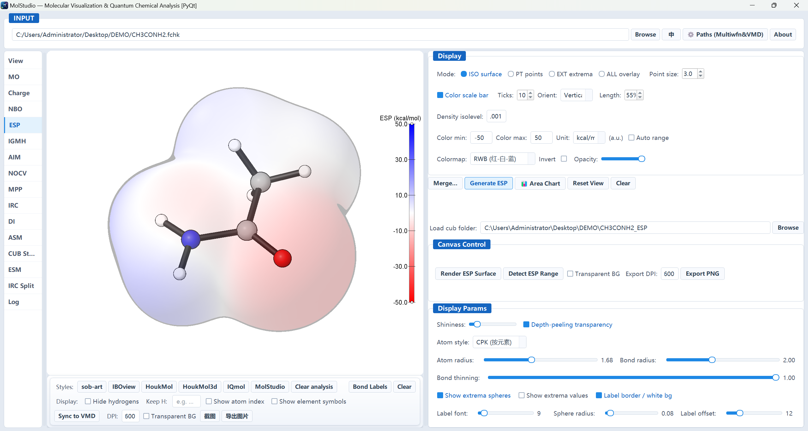
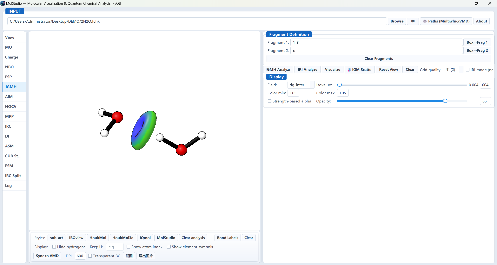
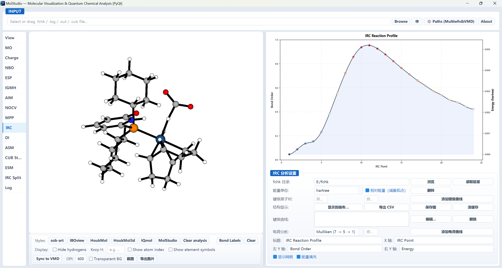

# GXNU MolStudio: An Open-Source Desktop Environment for Molecular Visualization and Quantum Chemical Analysis

<!-- ══════════════════════════════════════════════════════════════════════
     ChemRxiv SHORT SOFTWARE NOTE — GXNU MolStudio v1.0 (2026)
     压缩自 docs/chemrxiv_draft.md（完整长稿，未改动）。
     本文为独立短稿，参考文献单独编号，与长稿编号不通用。
     ── 提交前必填（作者提供）────────────────────────────────────────
     [x] 作者姓名 / 单位 / ORCID / 通讯邮箱（Cheng Hou，单一作者）
     [x] 基金资助信息（NSFC 22463001）
     [x] 4 张插图已接入（docs/paper_figures/）
     [ ] 核对参考文献（见文末清单）
     ══════════════════════════════════════════════════════════════════════ -->

**Authors:** Cheng Hou<sup>1,*</sup>

<sup>1</sup> School of Chemistry and Pharmaceutical Sciences, Guangxi Normal University, Guilin 541004, P. R. China

<sup>*</sup> Correspondence: houcheng@gxnu.edu.cn; ORCID: 0000-0003-2967-0326

**Keywords:** molecular visualization; quantum chemical analysis; wavefunction analysis; graphical user interface; Multiwfn; open-source software

---

## Abstract

We present **GXNU MolStudio**, an open-source, bilingual (Chinese/English) desktop application that combines real-time molecular visualization with a broad suite of quantum chemical analyses in a single environment. MolStudio embeds a custom OpenGL 3.3 renderer for molecules, orbitals, and property-colored isosurfaces with publication-oriented styling, and couples it to scripted invocations of the wavefunction-analysis program Multiwfn. Fourteen panels cover orbital and isosurface rendering (including spin density), six atomic-charge schemes, Mayer bond orders, NBO donor–acceptor analysis, electrostatic-potential surfaces with extrema and area distributions, IGMH/IRI weak-interaction analysis, QTAIM topology, ETS-NOCV energy decomposition, molecular planarity (MPP),[21] IRC profiling, distortion–interaction and energetic-span analysis, activation-strain scanning along an IRC, and multi-cube overlay. Because every panel acts on one shared canvas with a common atom-picking protocol, results from different analyses are directly comparable on the same structure. A compatibility channel to VMD/Tachyon supplies ray-traced figures with more than thirty curated styles. MolStudio is distributed as Python source (PyQt5, Python ≥ 3.8) and as a standalone Windows executable under the GNU General Public License v3.0 (GPLv3-only). The software is freely available at https://github.com/houcheng-gxnu/GXNU-MolStudio.

---

## 1. Introduction

Quantum chemical calculations are routine in chemistry, but turning raw outputs — formatted checkpoint (`.fchk`) files, Gaussian cube grids, and log files — into chemical insight still requires assembling a patchwork of programs. Visualizers such as VMD,[1] Avogadro,[2] and IboView[3,4] display structures and isosurfaces, while quantitative analyses — atomic charges, bond orders, NBO interactions, electrostatic-potential (ESP) surfaces, weak interactions, QTAIM topology, energy decompositions — are performed by dedicated codes, most prominently Multiwfn.[5,6] Reproducing a literature-style figure or answering a mechanistic question therefore forces the researcher to move data between several interfaces, manually match geometries and orbital indices, and restyle the same scene repeatedly.

Capable toolsets exist for individual analyses: the IGMH and IRI indicators and their accompanying toolbox,[7,8] ETS-NOCV viewers,[9] and various ESP surface viewers. What remains scarce, especially for teaching laboratories and small research groups, is a single low-friction environment in which a molecule loaded once can be examined by any of these methods without re-importing its geometry, and in which every numerical result has an immediate graphical counterpart that can be exported into a manuscript.

GXNU MolStudio was built to fill that gap. Three principles guided its design.

1. **One canvas, many analyses.** All structures, orbitals, isosurfaces, and color-mapped properties are drawn in a single embedded OpenGL viewport, and every analysis panel operates on that same canvas. A user can, for example, overlay an ESP surface, locate its extrema, and then interrogate the corresponding NBO interaction or QTAIM critical point without reloading anything.
2. **Multiwfn as the computation engine.** Wherever a wavefunction-derived quantity is required, MolStudio drives Multiwfn through scripted command sequences, automating cube generation and property evaluation while preserving control over grid quality and file management. Users interact with chemistry rather than with console prompts.
3. **Publication-oriented output.** Every module exports figures (PNG/SVG/PDF), data (CSV), or formatted reports (HTML), and a compatibility channel to VMD/Tachyon provides high-resolution ray-traced images for journal figures and covers.

MolStudio is bilingual with instant switching, accepts drag-and-drop input, offers a command-line batch mode, and ships as a standalone Windows executable for users without a Python environment. It is released under GPLv3-only (Section 5).

{ width=6.5in }

**Figure 1.** The GXNU MolStudio workspace: navigation rail (left), the shared OpenGL canvas (centre), and the active analysis panel (right).

## 2. Design and Implementation

### 2.1 Architecture

MolStudio is written in Python 3.8+ using PyQt5 for the interface and matplotlib for embedded charts. The main window has three regions: a left navigation rail, a central canvas column, and a right-hand stack holding the active panel (Figure 1). The codebase is modular: an entry point with splash screen and command-line batch mode, the application shell that orchestrates the panels, a backend module for cube generation and style presets, the `ovcanvas/` package holding the OpenGL renderer and canvas controls, a cube parser and isosurface extractor, and one module per panel. All panels receive the same canvas handle and register atom-pick callbacks, which is what makes behaviors such as "click an atom to query its charge, select it for a bond-order calculation, or add it to an IGMH fragment" consistent across the entire program.

Grid data are parsed by a native Gaussian-cube reader, and isosurface meshes are extracted with PyMCubes through a thin wrapper that also computes vertex normals. Heavy numerical tasks run in worker threads with progress reporting, and external processes can be cancelled cleanly. To eliminate the first-interaction latency caused by shader just-in-time compilation, all GLSL shaders are compiled during the splash screen.

### 2.2 Why Multiwfn is invoked rather than re-implemented

Every wavefunction-derived quantity in MolStudio is obtained by driving **Multiwfn** (version 3.8, released on 2026-01-07, and the subsequent date-versioned releases; the current development cycle was tested against the 2026.4.10 build)[5,6] as an external process, configured once through a settings dialog. Three considerations motivated this choice. First, it guarantees that any number shown in the interface is identical to the value produced by the reference implementation the community already validates and cites, so GUI-obtained results are directly comparable with the literature. Second, the analysis backend tracks Multiwfn updates — new charge definitions, new real-space functions, revised defaults — without any change to MolStudio itself. Third, it avoids silently diverging from the reference in edge cases (open-shell treatments, effective core potentials, integration-grid choices) where subtle implementation differences are easy to introduce and hard to detect. The cost is that Multiwfn must be installed separately: it is invoked as a separate process, is not redistributed with MolStudio, and its own terms govern its use (Section 5).

### 2.3 Rendering

The real-time viewport is an OpenGL 3.3 Core renderer (PyOpenGL) that draws ball-and-stick models and isosurfaces with Phong-style lighting, per-element color tables, and an in-canvas, user-draggable color scale bar. Overlapping translucent isosurfaces are composited by **depth peeling**, which avoids the artifacts of naive alpha blending; when depth peeling is unavailable, the renderer falls back to depth-sorted blending.

The rendering pipeline — depth-peeling transparency, the Phong lighting model, ball-and-stick geometry, the shader-register model, and the atomic-radii and covalent-radii tables — is a **Python port of the IboView** engine.[3,4] MolStudio is consequently a derivative work of IboView and is distributed under the same license; this is stated explicitly in Section 5.

## 3. Capabilities

### 3.1 Interactive visualization

The embedded canvas offers one-click view presets that reproduce the visual conventions of sob-art, IBOview,[3] HoukMol, and IQmol aesthetics, combined with orthogonal choices of per-atom color scheme and lighting rig (one to four lights, each with adjustable glow). Display helpers include hydrogen hiding with "keep specified H" options, per-atom index or element-symbol labels, and a Houk-style crosshair ring on the molecular plane. Properties are mapped onto the scene directly: atomic charges onto a diverging color scale, per-atom signed deviations (for example MPP planarity) onto a blue–white–red scale, and ESP or IGMH fields as vertex-colored isosurfaces. Clicking an atom highlights it and triggers the relevant action in the active panel, and Shift+left-drag provides rubber-band fragment selection.

For ray-traced, publication-grade images, a compatibility channel scripts VMD[1] with more than thirty curated color, material, and lighting presets (adapted from the vcube 2.0 collections[10]) and renders final images with the Tachyon ray tracer[11] at arbitrary resolution (tested above 3000 px), optionally with a transparent background. An optional "sync to VMD" control mirrors the in-canvas view, so a scene refined interactively can be reproduced as an equivalent VMD figure without redoing the setup.

### 3.2 Analysis and workflow panels

MolStudio provides fourteen panels — eleven analysis panels and three workflow panels. Each reads the currently loaded molecule or its own input files, performs the analysis (usually by scripting Multiwfn), and presents both numerical results and an immediate update of the canvas or an embedded chart.

| Panel | Function |
|---|---|
| Orbitals | Orbital-energy table with occupations and HOMO/LUMO markers; double-click to generate a cube and render the isosurface; multiple orbitals displayed simultaneously; spin-density isosurfaces for open-shell systems |
| Charges & bond orders | Six atomic-charge schemes (ADCH,[12] Hirshfeld, Mulliken, CM5, SCPA, VDD) in a sortable, CSV-exportable table; Mayer bond orders[13] for selected atom pairs |
| NBO | Natural orbitals with occupations and E(2) second-order donor–acceptor interactions from `pop=nbo` output; NBO levels matched to MO indices for on-demand isosurface generation |
| ESP | Electron-density and ESP cube grids; van der Waals isosurface (ρ = 0.001 a.u.) colored by ESP, with ISO / PT / EXT / ALL display modes, extrema markers, surface-area distribution histogram, and a library of diverging and sequential colormaps |
| IGMH / IRI | Fragment definition by atom picking or index ranges; `dg_inter` / `dg_intra` / `dg` / `sl2r` grids; weak-interaction isosurfaces colored by sign(λ₂)ρ with the BGR scale; interactive IGM Map scatter plot |
| AIM (QTAIM) | Critical-point search and bond-path following; critical points colored by type and queryable for ρ, ∇²ρ, kinetic and energy densities, and ellipticity |
| ETS-NOCV | Energy decomposition from a complex and two fragments; NOCV pair table (ΔE_pair, orbital labels, eigenvalues); on-demand deformation-density cubes |
| MPP | Molecular planarity parameter and signed plane-deviation span (SDP)[21] from a fitted plane; atoms colored by signed distance (±0.5 Å diverging scale) |
| IRC | Batch extraction of energies and Mayer bond orders along an IRC directory (results cached by file hash); dual-axis bond-order/energy profile with clickable points that load the corresponding structure |
| DI | Distortion–interaction (activation strain) analysis from five Gaussian log files, with optional ZPE or Gibbs corrections; energy-ladder diagram, bar chart, and HTML report |
| Energy span | Kozuch–Shaik energetic-span analysis: identifies the turnover-determining intermediate and transition state, computes δE and TOF, and plots the stepwise free-energy profile |
| ASM scan | Applies the distortion–interaction decomposition at *every* point of an IRC, plotting ΔE_strain, ΔE_int, and ΔE along the reaction coordinate |
| CUB stack | Overlays several Gaussian cube files on one structure, each with independent positive/negative phase colors and inversion, sharing a single isovalue and opacity |
| IRC split | Parses a Gaussian IRC output, browses its structures point by point on the canvas, and splits the path into per-point single-point `.gjf` inputs |

Method-level references for the underlying analyses are given above and in the reference list.[7,8,12,13,14,15,16,17,18,19,21]

{ width=6.5in }

**Figure 2.** Electrostatic-potential analysis: the van der Waals isosurface colored by ESP, with extrema markers and the in-canvas color scale bar.

{ width=6.5in }

**Figure 3.** IGMH weak-interaction analysis: the inter-fragment isosurface colored by sign(λ₂)ρ on the blue–green–red scale, together with the IGM Map scatter plot.

{ width=6.5in }

**Figure 4.** Reaction-path analysis: Mayer bond orders and energies along an IRC, with the corresponding structure loaded in the viewport, and QTAIM critical points and bond paths on the same canvas.

### 3.3 File formats and interoperability

MolStudio accepts Gaussian formatted checkpoints (`.fchk`) as its primary input (structure, orbitals, energies, wavefunction), Gaussian `.log`/`.out` for geometries and SCF energies, Gaussian cube files (`.cub`/`.cube`) for direct isosurface and ESP rendering without recomputation, and XYZ, Molden, PQR, PDB, and WFN files for structure input and for the AIM and MPP modules. Drag-and-drop is accepted anywhere in the main window. Native parsers convert coordinates from Bohr to Å, detect bonds from covalent radii, and populate both the canvas and the orbital table in one step. Pairs of precomputed density and ESP cube files can be loaded directly, so figures can be regenerated without re-running Multiwfn.

A command-line batch mode automates cube generation and rendering over whole directories, for example:

```bash
python main.py ./fchk_folder/ --mo h,l --iso 0.05 --style sob-art
```

## 4. Representative Use Cases

Three scenarios illustrate the intended workflows.

**Routine visualization and teaching.** Load a `.fchk` file, inspect the HOMO–LUMO gap in the orbital table, double-click the HOMO to generate its isosurface, cycle through the one-click styles, and export a PNG — all without touching a terminal.

**Charge and bonding analysis.** Compute Hirshfeld (or any other) charges and Mayer bond orders; color the molecule by charge; click individual atoms to read their values; export the table as CSV for the Supporting Information.

**Mechanistic study.** Import an IRC directory, overlay key bond orders on the energy profile, click the transition-state point to inspect its geometry on the canvas, then run the DI panel (five log files) to decompose the barrier and the Energy Span panel to locate the turnover-determining steps. Applying the ASM scan panel to the same pathway then follows ΔE_strain and ΔE_int point by point along the entire reaction coordinate, yielding a complete energy picture of the reaction.

## 5. Licensing, Third-Party Notices, and Derivative-Work Statement

MolStudio is free software distributed under the **GNU General Public License version 3.0 (GPLv3-only)**; the full license text is included in the repository. Because IboView is licensed under GPLv3 only (not "or later"), MolStudio is likewise GPLv3-only while it contains IboView-derived code, and may not be re-declared under a later version of the license.

**Rendering engine (derivative work of IboView).** The OpenGL rendering pipeline — including its depth-peeling transparency, Phong lighting model, ball-and-stick geometry, shader-register model, and the atomic-radii and covalent-radii data tables — is a Python port of the IboView program (http://iboview.org/; the port was made against the IboView v20211019-RevA distribution, which its author labels a pre-release — the last official release is v20150427).[3] IboView is copyrighted by Gerald Knizia (Copyright © 2015, GPLv3) and implements the intrinsic-atomic-orbital analysis of Knizia and co-workers.[3,4] We state the extent of this derivation explicitly because it is directly verifiable from the source: the atomic-radii table (104 entries) and the covalent-radii table (108 of 110 entries) are numerically identical to IboView's `AtomicRadii` and `g_CovalentRadii`, and the depth-peeling composite shader, the shader-register and fog expressions, and several default rendering parameters are likewise ported. An itemized audit is maintained in `docs/iboview_transplant_audit.md`. Components **not** derived from IboView include the van der Waals radii (Bondi, 1964), the element color palettes (Jmol/CPK, GaussView, and in-house sets), the isosurface meshing, the tiled high-resolution export path, the entire user interface, and all fourteen panels.

In accordance with GPLv3 §5, the original copyright notice and a statement of modification are preserved in the affected source files and in the repository's third-party notices, the complete corresponding source is published, and the work as a whole is distributed under the same license. Downstream redistributors must retain these notices and keep modified versions under GPLv3-only. Citing IboView in derivative publications is requested.

**Other third-party components.** MolStudio's analyses rely on the external program Multiwfn,[5,6] invoked as a separate process and not redistributed with MolStudio. VMD[1] and Tachyon[11] are optional external executables used only by the legacy rendering channel; the VMD style collections are adapted from vcube 2.0 by C. Zhong.[10] PyQt5, PyOpenGL, NumPy, SciPy, PyMCubes, and matplotlib are used under their respective licenses. A complete `THIRD-PARTY-NOTICES.md` is maintained in the repository.

**In-house components.** Several panels were adapted from earlier tools developed in the same group and are relicensed here under GPLv3 together with MolStudio: the IGMH/IRI panel from IGMH_Toolbox V4 (Zenodo, doi:10.5281/zenodo.20791253),[20] the charge panel from the group's earlier ChargeViewer tool, and the molecular-planarity panel from `mpp_auto_qt.py`. Credits are listed in `THIRD-PARTY-NOTICES.md`.

## 6. Conclusions

GXNU MolStudio couples an interactive OpenGL visualizer with a comprehensive, Multiwfn-driven suite of quantum chemical analyses in a single bilingual desktop environment. Its one-canvas architecture, scripted integration of external engines, and publication-oriented exports lower the barrier for research and teaching alike, while its GPLv3 licensing ensures that the community can audit, extend, and redistribute it. Planned development includes further wavefunction analyses, additional journal-style export templates, support for more quantum chemistry packages, and an expanded set of automated regression examples.

## Data and Code Availability

GXNU MolStudio v1.0.0 is open source under GPLv3-only. The source repository is publicly available at https://github.com/houcheng-gxnu/GXNU-MolStudio, with a mirror at https://cnb.cool/chem311/GXNU-MolStudio. A standalone Windows executable is released alongside this preprint. An archived, citable snapshot of the version described here is deposited on Zenodo (doi:10.5281/zenodo.22821586). Third-party notices, the derivative-work statement for the IboView-based rendering engine, and the itemized porting audit are provided in `THIRD-PARTY-NOTICES.md` and `docs/iboview_transplant_audit.md` in the repository. To cite the software itself:

> Hou, C. *GXNU MolStudio: Molecular Visualization and Quantum Chemical Analysis*, version 1.0.0; Zenodo, 2026. doi:10.5281/zenodo.22821586

## Author Contributions

C.H. conceived and supervised the project, developed the code, integrated the analysis modules, and prepared the figures and manuscript.

## Conflicts of Interest

The authors declare no competing financial interest.

## Acknowledgements

This work was supported by the National Natural Science Foundation of China (grant no. 22463001). We thank Dr. Tian Lu for Multiwfn, Prof. Gerald Knizia for IboView, whose rendering pipeline underlies the MolStudio canvas under GPLv3, and Dr. Cheng Zhong for the vcube 2.0 style collections.

## References

1. Humphrey, W.; Dalke, A.; Schulten, K. VMD: Visual Molecular Dynamics. *J. Mol. Graphics* **1996**, *14*, 33–38.
2. Hanwell, M. D.; Curtis, D. E.; Lonie, D. C.; Vandermeersch, T.; Zurek, E.; Hutchison, G. R. Avogadro: An Advanced Semantic Chemical Editor, Visualization, and Analysis Platform. *J. Cheminform.* **2012**, *4*, 17.
3. Knizia, G. IboView — A program for chemical analysis; http://www.iboview.org/ (accessed 2026). The port was made against the IboView v20211019-RevA distribution, which its author labels a pre-release; the last official release is v20150427.
4. Knizia, G. Intrinsic Atomic Orbitals: An Unbiased Bridge between Quantum Theory and Chemical Concepts. *J. Chem. Theory Comput.* **2013**, *9*, 4834–4843.
5. Lu, T.; Chen, F. Multiwfn: A Multifunctional Wavefunction Analyzer. *J. Comput. Chem.* **2012**, *33*, 580–592. See also: Lu, T. A Comprehensive Electron Wavefunction Analysis Toolbox for Chemists, Multiwfn. *J. Chem. Phys.* **2024**, *161*,.
6. Lu, T. Multiwfn, version 2026.4.10 [computer software]; http://sobereva.com/multiwfn/ (accessed 2026).
7. Lu, T.; Chen, Q. Independent Gradient Model Based on Hirshfeld Partition (IGMH): A New Method for Visual Study of Interactions in Chemical Systems. *J. Comput. Chem.* **2022**, *43*, 539–555.
8. Lu, T.; Chen, Q. Interaction Region Indicator (IRI): A Simple Real Space Function Clearly Revealing Both Chemical Bonds and Weak Interactions. *Chemistry–Methods* **2021**, *1*, 231–239.
9. Mitoraj, M. P.; Michalak, A.; Ziegler, T. A Combined Charge and Energy Decomposition Scheme for Bond Analysis. *J. Chem. Theory Comput.* **2009**, *5*, 962–975.
10. Zhong, C. vcube 2.0 — Tcl scripts for batch rendering of Gaussian cube files with VMD; 计算化学公社 (Computational Chemistry Commune), thread 18150; http://bbs.keinsci.com/thread-18150-1-1.html (accessed 2026).
11. Stone, J. E. An Efficient Library for Parallel Ray Tracing and Animation. M.S. Thesis, University of Missouri—Rolla, 1998.
12. Lu, T.; Chen, F. Atomic Dipole Moment Corrected Hirshfeld (ADCH) Population Method. *J. Theor. Comput. Chem.* **2012**, *11*, 163–183.
13. Mayer, I. Charge, Bond Order and Valence in the Ab Initio SCF Theory. *Chem. Phys. Lett.* **1983**, *97*, 270–274.
14. Weinhold, F.; Landis, C. R. *Valency and Bonding: A Natural Bond Orbital Donor–Acceptor Perspective*; Cambridge University Press: Cambridge, 2005.
15. Murray, J. S.; Politzer, P. The Electrostatic Potential: An Overview. *WIREs Comput. Mol. Sci.* **2011**, *1*, 153–163.
16. Bader, R. F. W. *Atoms in Molecules: A Quantum Theory*; Oxford University Press: Oxford, 1990.
17. Fukui, K. The Path of Chemical Reactions — The IRC Approach. *Acc. Chem. Res.* **1981**, *14*, 363–368.
18. Kozuch, S.; Shaik, S. How to Conceptualize Catalytic Cycles? The Energetic Span Model. *Acc. Chem. Res.* **2011**, *44*, 101–110.
19. Bickelhaupt, F. M.; Houk, K. N. Analyzing Reaction Rates with the Distortion/Interaction–Activation Strain Model. *Angew. Chem. Int. Ed.* **2017**, *56*, 10070–10086.
20. Hou, C. IGMH_Toolbox (Version 1.0.0) [Computer software]. Zenodo, 2026.

21. Lu, T. Simple, Reliable, and Universal Metrics of Molecular Planarity. *J. Mol. Model.* **2021**, *27*, 263.

---

<!-- ═══════════════ 提交前清单 ═══════════════
[x] 作者：Cheng Hou（单一作者），ORCID 0000-0003-2967-0326，
    通讯 houcheng@gxnu.edu.cn，广西师范大学化学与药学学院
[x] 资助：National Natural Science Foundation of China (22463001)
[x] 插图：4 张已接入 docs/paper_figures/（2560×1368 真实界面截图）
      fig1_main_window.png  主窗口总览
      fig2_esp.png          ESP 分析面板
      fig3_igmh.png         IGMH 弱相互作用分析
      fig4_irc_qtaim.png    反应分析（IRC + QTAIM）
      · .gitignore 已加 !/docs/paper_figures/*.png 例外，否则会被 *.png 规则挡掉
[x] 参考文献已按作者审计逐条修订（21 → 20 条，删去 ChargeViewer）：
      IboView 官方题名、IGMH 页码 539–555、vcube 2.0 出处、4 处 DOI、
      Multiwfn 版本标注、Mitoraj 标题
[ ] 逐张核对图注与画面实际内容是否一致（图 4 尤其需要确认）
[ ] 确认界面语言：ChemRxiv 为英文平台，若截图为中文界面建议重截
[ ] ChemRxiv 接收后回填 DOI
── 与长稿 docs/chemrxiv_draft.md 的关系 ──
  · 本文为压缩短稿，参考文献为独立编号（20 条），长稿为 23 条，两者不通用。
  · 长稿已于 2026-09-18 同步修订：面板数 11→14（新增 §4.13–4.15）、
    IboView 题名、IGMH 页码、vcube 2.0 出处、Mitoraj 标题、Zenodo DOI、
    作者/ORCID/基金，并按同一审计删除 ChargeViewer 条目（引用重编号完成）。
═══════════════════════════════════════════ -->
